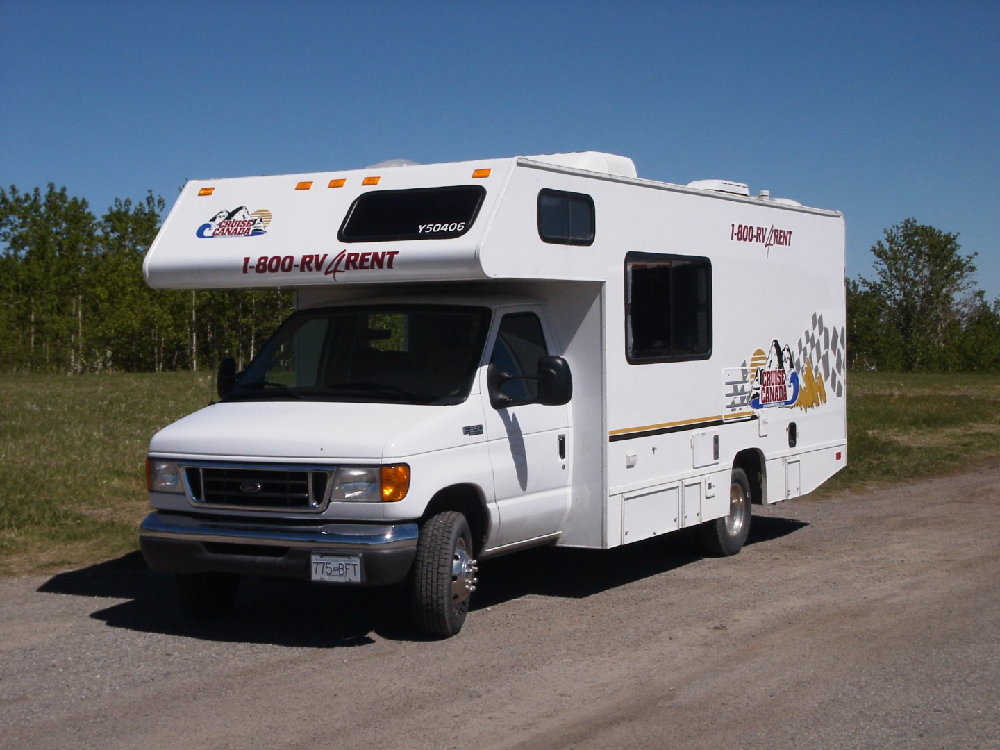
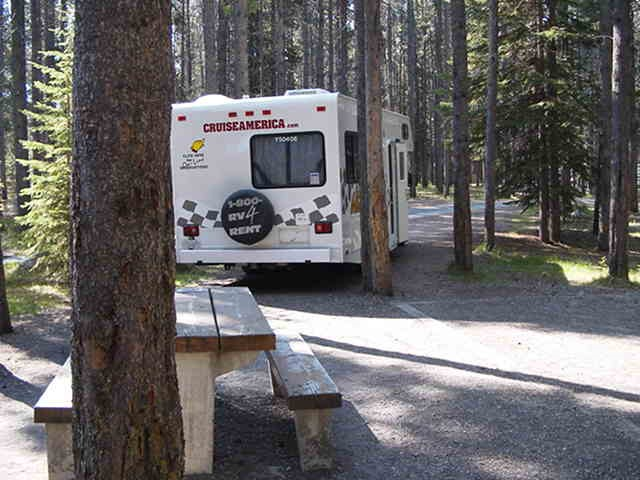

Vanmorgen om 8 uur hebben we gebeld met Cruise Canada om een afspraak te maken voor het ophalen van de camper. We kunnen al om 9 uur terecht. Maar we moeten nog ontbijten, dus we maken er maar 10 uur van. Het ontbijt was lekker, maar natuurlijk veel te veel en erg vet.

Bij Cruise Canada aangekomen krijgen we eerst een instructievideo te zien die alles uitlegt. Daarna nog een rondleiding en dan op naar de supermarkt, Safeway, vlak bij de camperverhuurder. Na de hele winkelkar vol geladen te hebben met eten en drinken (geen bier, in Canada mogen supermarkten geen alcohol verkopen) lopen we naar de kassa. En wat blijkt, de cassiere is een Nederlandse die in Calgary woont sinds 1967. Ze praat nog erg goed Nederlands en geeft ons wat extra bonnen voor korting op benzine!

En dan op naar Banff National Park, een ritje van zo'n 120 km. Het blijkt dat alle pannen, borden en bekers los in de kastjes staan, dus alles rammelt zo erg dat we vlak buiten Calgary maar stoppen op een parkeerplaats om overal keukenpapier tussen te doen. Zo, nu kunnen we elkaar weer verstaan :-)

Op zich rijdt het prima zo'n camper, het is alleen erg lastig om te zien wat er achter je gebeurt.

Bij Banff aangekomen, kopen we een National Parks Pass. Aangezien het inmiddels al redelijk laat is, besluiten we om maar direct een camping op te gaan zoeken. Maar eerst rijden we even naar de Cascade Ponds, wat op de route ligt naar de camping. Het blijkt een leuk meertje te zijn met wat strandjes.

We komen uiteindelijk aan bij Two Jack Lakeside Campground. Direct na aankomst op onze plek (nr 56, op zo'n 20 meter van het meer, met een erg mooi uitzicht) hebben we vrijwel direct aanspraak met onze buurman. Hij blijkt zeer enthousiast te zijn en wil ons zelfs morgen zijn auto lenen om om 6 uur in de ochtend op zoek te gaan naar beren en ander wild life. We slaan zijn aanbod vriendelijk af, omdat we morgen nog wat boodschappen moeten doen.

