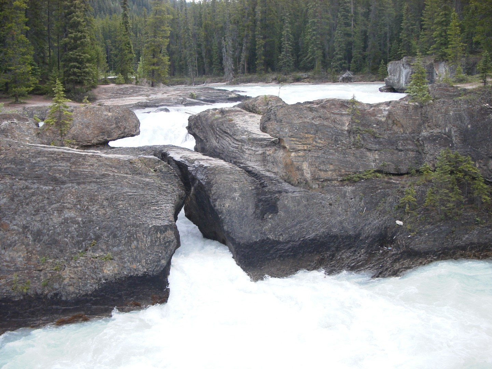
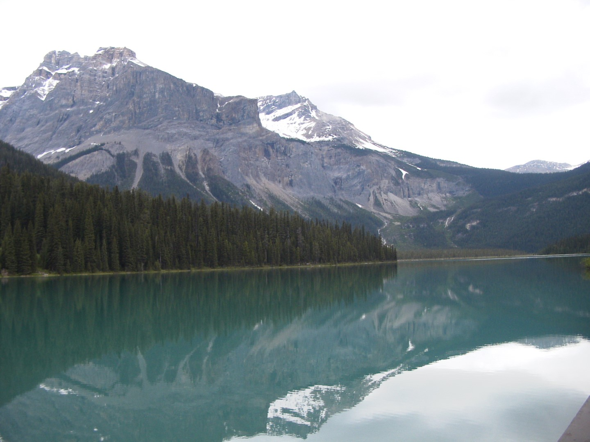

Vanmorgen zijn we eerst naar Field gereden om alvast een kampeerplekje te claimen op de Kicking Horse Campground. Het is een heel mooie camping, de toiletgebouwen zijn oud, maar wel schoon. Hier zit geen mannetje bij de receptie, dus een "self register".

Daarna naar Natural Bridge gegaan. Het is niet echt super spectaculair, maar toch wel de moeite waard.

Op dezelfde weg ligt Emeral Lake. Hier maken we een simpele wandeling rond het meer.

Na de wandeling hebben we in Field wat boodschappen gedaan, want het is BBQ weer!

Toen ik op de camping de vuilnis ging weggooien liepen de twee Nederlandse mannen (Herman en Evert ;-)) die we gisteren tegenkwamen bij Lake Agnes ook op de camping. Toch toevallig.
