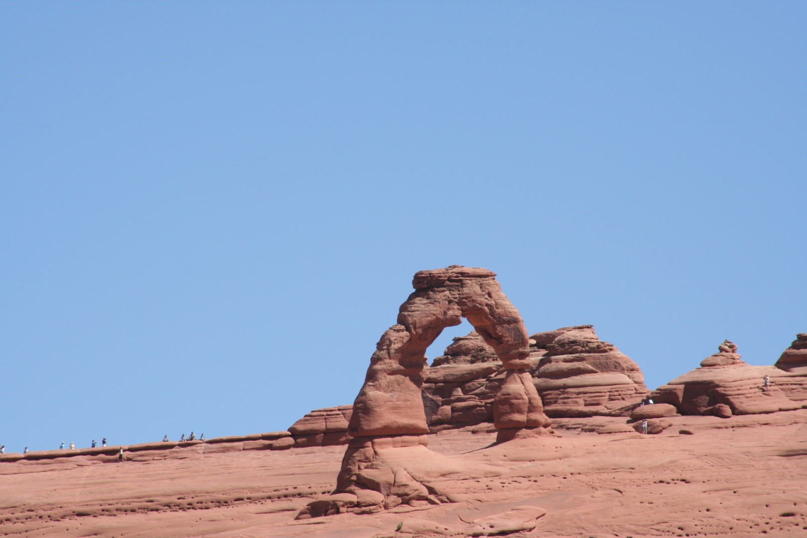
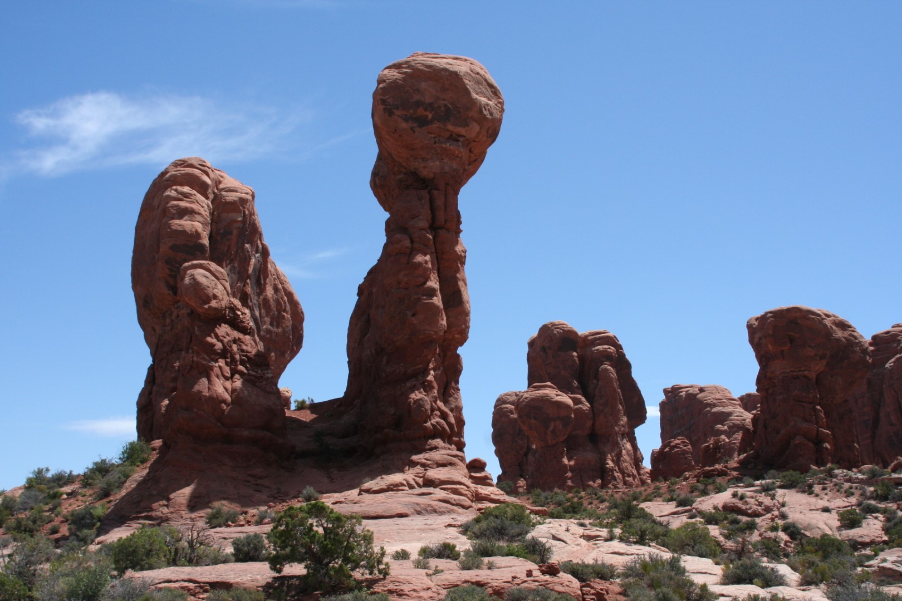
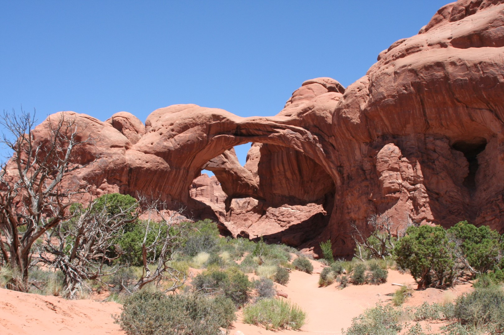
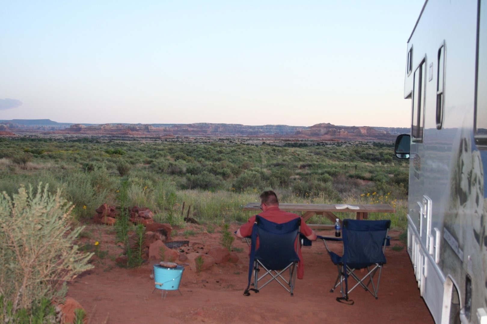

We zijn op ons gemak wakker geworden en hebben in alle rust ontbeten. We zijn gisteren beiden behoorlijk verbrand, dus we gaan het rustig aan doen vandaag. We hebben een redelijke rit voor de boeg naar The Needles, in het zuiden van Canyonlands National Park. Op weg naar de uitgang van Arches zijn we nog gestopt bij de Wolfe Ranch en Delicate Arch, de Garden of Eden en de Windows.

In Moab doen we nog wat boodschappen en tanken, en toen zijn we naar de Needles Lookout gereden. Vanaf de UT-191 is dat zo'n 20 mijl heen en 20 mijl terug. Het uitzicht is op zich wel mooi, maar om er nou 40 mijl voor om te rijden...

Daarna zijn we naar The Needles gereden en op de Needles Outpost Campground een plekje uitgezocht. De mevrouw bij de receptie was kacheltje lam, wat op zich wel grappig was. Het is een prachtige plek midden in de woestijn. 's Avonds hebben we lekker buiten gezeten tot het donker werd. We hebben heel veel vleermuizen gezien.

