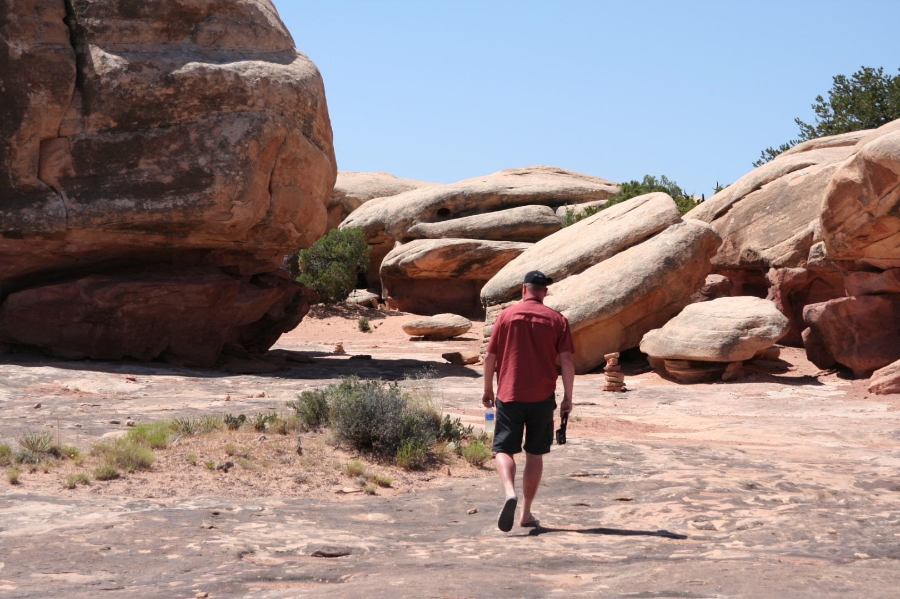
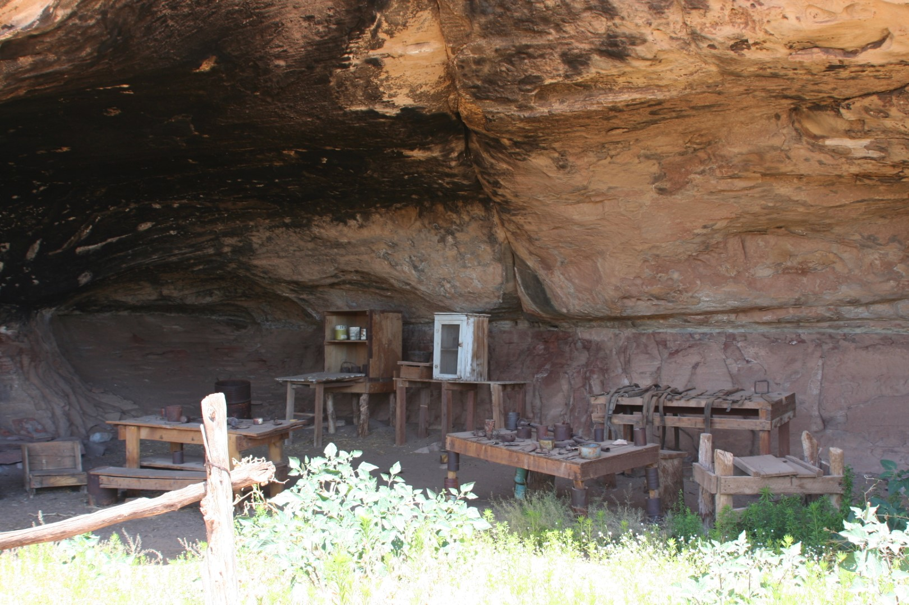
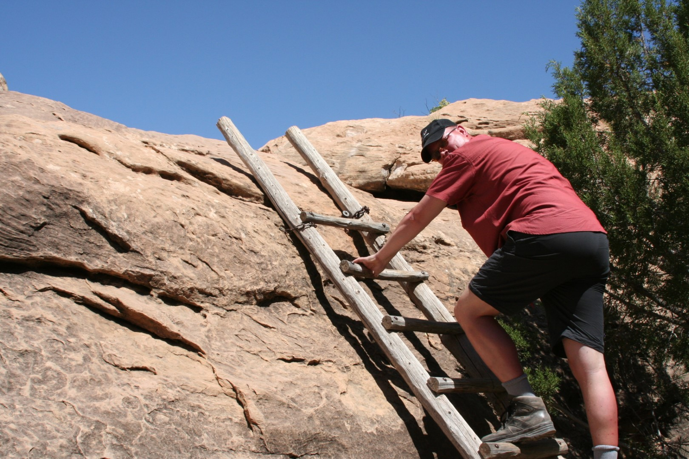
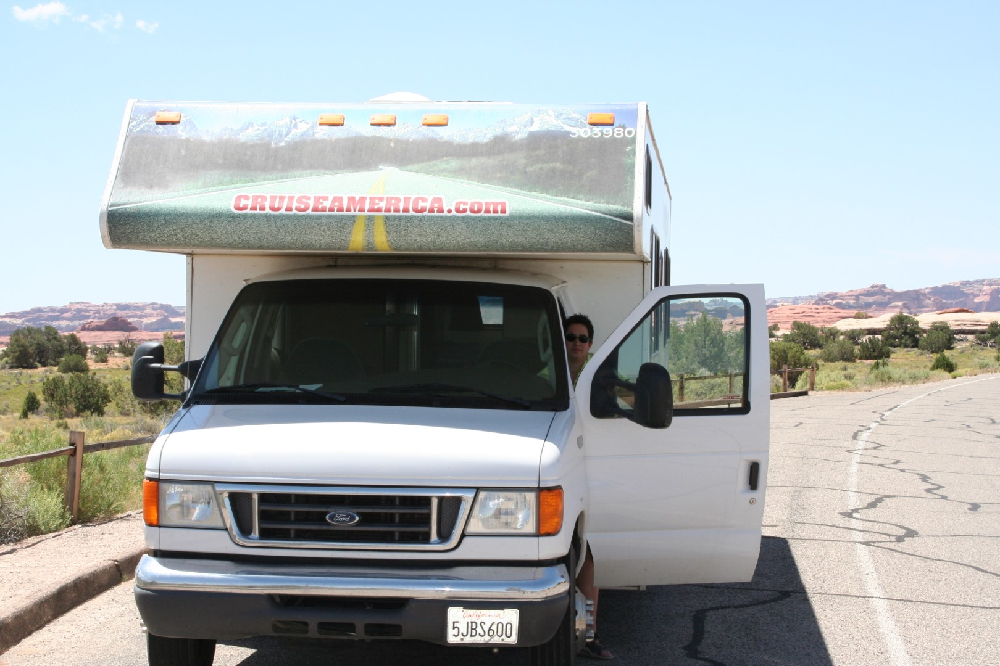

Om 10 uur hebben we de camping verlaten en zijn naar Big Spring Canyon Overlook gereden. Daarna hebben we de Potholes Trail gelopen, waar helaas niks aan was. Het is wel ongelooflijk heet!

Vlug zijn we doorgereden naar de Cave Spring Trail, die gelukkig wel erg leuk is.

Met behulp van twee ladders moeten we klimmen en klauteren. We komen nog langs een echte cowboy verblijfplaats.

Wierna zijn we nog even gestopt bij de Roadside Ruin en toen zijn we begonnen aan de tocht naar Grand Teton National Park. Dat is voor vandaag te ver. We overnachten in Vernal, Utah op de KOA.

Onze 30 feet RV is hier 1 van de kleinste campers!
