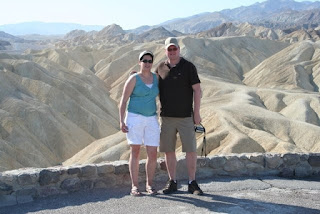
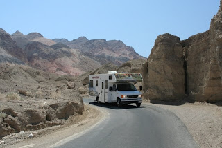
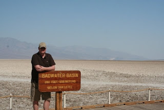

Aan het einde van de middag aangekomen in Death Valley. De camping heeft geen hookups, en dat is geen feest met 42 graden! We mogen de generator maar tot 7 uur gebruiken. Ik denk dat het om 23 uur nog steeds boven de 30 graden was, dus we hebben geslapen met alle ramen open. 's Morgens om 5 zijn we maar opgestaan, de temperatuur in de camper was niet meer te harden! Maar goed, we zijn gaan rondrijden en wat mooie dingen gezien.

<!--  -->

Morgen moeten we Cruise America bellen, we hebben een probleem met de koelkast. Vanmorgen al aan de telefoon gehangen want 't ding deed het helemaal niet. Na een of andere woeste combinatie van toetsen indrukken hadden we de indruk dat 'ie 't deed. Zo'n koelkast heeft 6 tot 8 uur nodig om goed te kunnen koelen, maar aan 't einde van de avond had ik nog steeds geen koud bier, en das natuurlijk niet de bedoeling. Morgenvroeg moeten we even terugbellen, dan komt er waarschijnlijk een monteur langs. Ben benieuwd...

Zoals ik al zei, het is hier meer dan 40 graden en dan moet je gewoon dingen kunnen koelen. Gelukkig hebben we nog geen vlees hoeven weggooien, de vriezer doet 't namelijk wel redelijk.
Death Valley is het laagste punt van Noord Amerika, ben zojuist op 86 meter onder de zeespiegel geweest!

## 6 opmerkingen

### Anoniem25 mei 2009 om 23:37

Hallo Daar,

Fijn om al dat nieuws te horen. We hebben ook al weer boekjes van de V.S. gehaald.
Zijn jullie al wezen BB-knoeien of kon dat gewoon op de motorkap in Death-Valley. Heerlijk zo'n vakantie, is stukken beter dan met Hemelvaart in de garage klussen.

Doei Doei!
Veel plezier!

De eetclub uit W&A

### Helen van Kuil26 mei 2009 om 00:18

Hallo Chantal en Roger,
Wat een mooie omgeving is het daar.
Ik hoop dat de koelkast gauw gemaakt wordt met die hitte.
Hier in Nederland is het ook mooie weer maar gelukkig niet zo warm als bij jullie.

Liefs en groetjes en nog heel veel plezier!

### Anoniem26 mei 2009 om 08:47

Hey Roger,

Je kan natuurlijk ook je bier in de vriezer doen hè! Ook dan heb je koud bier haha heel belangrijk!

Leuke camper hoor, maak ook eens foto's van het interieur?

Groetjes,
David

### Anoniem26 mei 2009 om 20:48

Roger, als je koelkast stuk is, dan moet je bier voor de roostertjes in het dashboard zetten. Zet vervolgens de airco op 100 en klaar is Cees.

Koop anders zo'n coolbox of zo.
http://www1.conrad.nl/scripts/wgate/zcop_nl3/~flN0YXRlPTczMjM4NDgwOA==?~template=PCAT_AREA_S_BROWSE&glb_user_js=Y&shop=NL2&p_init_ipc=X&zhmmh_area_kz=&direkt_aufriss_area=0822018&~cookies=1&scrwidth=1440

Groetjes,

Ronald

### Unknown28 mei 2009 om 23:07

Roger, denk Engels dan is een lauw biertje ook acceptabel..... (niet ech). Maar zijn jullie nog Death Valley uitgekomen, of leven jullie daar nu van ratelslangen. Reminder de zon komt op in het oosten... so u know... ;-)

### Gerard30 mei 2009 om 11:26

Hallo daar, wij zijn erg benieuwd hoe het gaat met jullie en willen graag wat van je belevenissen meegenieten. De blog is echter erg stil. Wij denken dat jullie geen tijd over hebben om de blog te vullen gezien alle wat je meemaakt en ziet.
Groetjes

Helen en Gerard
