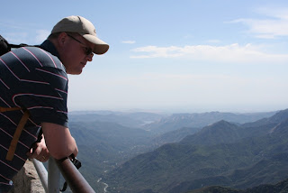
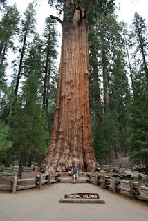
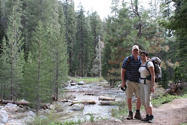
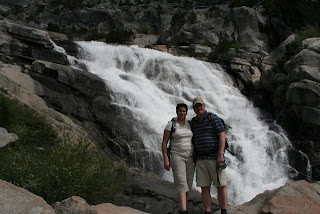

De laatste 3 dagen hadden we geen internetverbinding, vandaar dat het wat stil was op het blog-front. We zitten namelijk midden in Sequoia National Park, en daar is een of ander fancy hotel waar we illegaal internet aftappen :-) We hadden de sequoia's natuurlijk al eens eerder gezien, maar het blijft indrukwekkend, zo'n boom van bijna 100 meter hoog! Al helemaal als je er de hele dag tussen mag lopen.

We hebben dus al een aantal heel (ik leer het wel, Ronald) mooie wandelingen gemaakt, en zijn helaas bij de eerste wandeling ook al weer een beer tegen gekomen. Gelukkig was hij deze keer nog ver weg en had hij ons nog niet gezien (dat denken we in ieder geval). Iedereen zegt: Consider yourself lucky... Als we dan zo gelukkig zijn, dan hadden we misschien toch een gokje moeten wagen in Las Vegas :-)
Nu gaan we weer richting de bushbush van Kings Canyon, dus de komende drie dagen waarschijnlijk geen nieuwe items in het blog.

Het probleem met de koelkast is opgelost, we hebben Cruise America gebeld en met een of andere woeste code hebben we 't ding weten te resetten. Dus ik heb gelukkig weer KOUD BIER! Blijft toch een primaire levensbehoefte, samen met de BBQ, die we inmiddels ook al een aantal keren gebruikt hebben.

In ieder geval leuk dat er reacties op onze berichtjes zijn gekomen, en tot snel!

## 4 opmerkingen

### Gerard 31 mei 2009 om 10:13

Hé vakantiegangers.
Ik ben jaloers, niet op het koude bier, maar wel op de mooie omgeving waarin jullie reizen. En, die grote boom de sequoia, die had ik ook in de tuin. Maar goed, dat hij een overplanting niet heeft gehaald. Ten slotte, doe maar niet de groeten aan Beer....

Groetjes

### Sergio 1 juni 2009 om 14:44

Wat ben je klein naast zo'n boom!!!
veel plezier

### Anoniem 2 juni 2009 om 09:10

Gisterochtend heb ik 'Pulp Fiction' maar weer eens aangezet.
Ik ben gekomen tot het deel waarin Mia de stash van Vincent op een verkeerde manier probeerde te consumeren. Op dat moment kwam Lorelai bij me zitten, en om haar op zo'n jonge leeftijd daar nou mee te confronteren.....
We moeten toch echt maar eens een Tarantino avond plannen als jullie terug zijn, en als jullie niet opgegeten zijn door een hongerige familie beren.

Grtz,

Ronald

### Anoniem 22 juni 2009 om 16:32

Zie nu hoe het moet. Leren alles, gaat alleen niet meer zo vlug.
Wiel Baten
