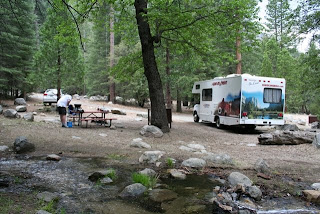

Hallo allen,

Blijkbaar hebben we een maandagochtend modelletje gekregen: na de problemen met de koelkast, zitten we nu bij Big 'O Tires voor een probleem met de remmen! Ik had vorige week al een slecht voorgevoel dat het niet de laatste keer zou zijn dat ik de Cruise America Traveler's Assistance moest bellen :-( In Death Valley roken we al de remmen, maar toen dacht ik nog dat het door de hitte kwam. Onderweg van Kings Canyon naar Yosemite moest ik redelijk fors remmen, en toen hoorden we een of ander metaal-achtig geluid, en sindsdien piepen de remmen van de voorwielen continu. Lijkt wel of het hele remblok opgebrand is... Goede nieuws: we worden hopelijk snel geholpen door Big 'O himself, en we kunnen 't blog weer bijwerken.

Beetje irritant is het wel, we wilden vanmorgen juist vroeg vertrekken zodat we onderweg nog wat beren zouden kunnen zien. Gelukkig is de camping voor vanavond gereserveerd, dus daar hoeven we ons geen zorgen over te maken.

Als we thuis zijn gaan we een mooie brief schrijven richting Cruise America om al onze frustraties te uiten. Volgende keer wordt het in ieder geval GEEN Cruise America meer! Hoewel de service aan de telefoon meer dan keurig is.

Overigens is Kings Canyon waanzinnig mooi! En wie zegt dat je niet in de stromende regen kunt BBQ-en???

UPDATE: na 4 uur wachten krijgen we te horen dat er iets in het linker remblok is losgeschoten (?!?!?!). Volgens de monteur klinkt dat ernstiger dan het is. Onderdeel wordt nu vervangen, verwachting is dat we binnen 't uur weer onderweg kunnen.

## 4 opmerkingen

### Unknown 2 juni 2009 om 23:56

In het wilde westen moet je ook niet cruisen met Horse Power maar met Horses, YiHaa....
Ach het bier is nu toch koud, kan het eigenlijk al niet meer stuk toch.... en een meeting met Big'O' himself is toch een ervaring om niet te missen... Hoop dat dit het laatste gevalletje was.. BBQ, Beer en Babe heb je dus wat wil je nog meer :-)

### Anoniem 3 juni 2009 om 16:02

"In america, names have no meaning"
(Butch, zittend achterin de taxi nadat ie de bokswedstrijd had gewonnen).

Grtz,

Ronald

### Gerard 3 juni 2009 om 23:20

Jammer van een bijna verloren dag, maar toch veiligheid gaat boven alles. En jullie zijn nu zonder piepende remmen niet meer hoorbaar voor de beren. Misschien wordt de kans om ze te zien wel wat groter voor jullie. Roger, als ik het goed heb mag je niet met een BBQ onder een boom.
Wellicht valt er door de warmte extra proteïne uit de boom op je vlees. mmm.....
Doei and have a good travel you2.
Gerard

### fam. van Kuil (junior) 5 juni 2009 om 19:37

En nu maar hopen dat jullie vanaf nu lekker door kunnen cruisen in dat oh zo mooie gebied. Het ziet er prachtig uit!;)
