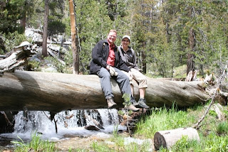

Ja, daar zijn we dan: aan de Pacific Ocean! Het is prachtig weer, en we zijn nu zo'n 150km ten zuiden van San Francisco. Morgen gaan we over de Golden Gate van de laatste dagen genieten.

## 4 opmerkingen:

### Anoniem 15 juni 2009 om 08:15

Oei, wat zijn wij jaloers! Leuk om jullie blog te lezen, volgens mij hebben jullie een zeer geslaagde vakantie. Geniet nog lekker van de laatste dagen. Aanrader voor SF: alcatraz, en dan vooral de laatste rondleiding van de dag. Je verlaat het eiland als het al donker is. Wel vooraf kaartjes boeken via Internet.

Groetjes, Nick (van Marjoleintje van het pleintje ;)

### Gerard 16 juni 2009 om 01:01

Naast het vele moois, dat jullie zien en beleven is er toch ook nog tijd voor een enorm bruinwerkersverhaal. Gelukkig dat "helaas nog geen foto's" op P.N.M slaat!!!!!!!want die wil ik wel zien.
Maar wat gaat de tijd snel, het zit er weer bijna op.
Geniet maar lekker.

Gerard

### Anoniem 16 juni 2009 om 19:23

193 gram

........(geintje)

### Anoniem 17 juni 2009 om 22:26

Wil meneer Roger normaal niet gezien worden met familieverpakkingen toiletpapier in de winkel, maar dicht wel een heel verhaal over waar je dat papier voor nodig hebt. Das nou lachen, hihi!!
