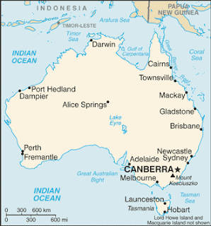
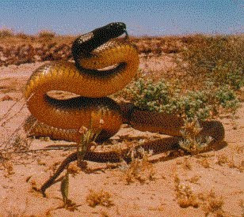

Volgens Wikipedia is Australië met een oppervlakte van 7.741.220 km² zo'n 186 keer zo groot als Nederland (met een oppervlakte van 41.526 km²). En toch kiezen de 22 miljoen inwoners ervoor om met z'n allen in Sydney, Melbourne, Brisbane, Perth of Adalaide te gaan wonen. De overige 4 bewoners wonen verspreid over de rest van het land.

En waarom is Australië nou toch zo'n populaire toeristische bestemming? Wellicht het feit dat de huidige bewoners allemaal afstammen van Engelse criminelen (het was in de 18e eeuw een Engelse strafkolonie)? Of misschien omdat het het enige land ter wereld is waarbinnen meer slangen wel giftig zijn dan niet (100 van de 170 soorten)? Bovendien huizen 7 van de 10 meest giftige slangensoorten ter wereld hier. Als voorbeeld: een volwassen man overlijdt na een beet van de Inlandse Taipan meestal in een paar minuten, maar zeker binnen 1 uur... In het algemeen wordt gezegd dat één beet genoeg gif oplevert om 100 mensen te doden.

Nee, ik vermoed dat het komt door die aardige Aboriginals (die meestal dronken zijn), of door kangoeroes (die tegen je auto botsen, of je een rotschop verkopen)...

En het mooiste van alles is dat we over een weekje in dit mooie land zullen aankomen... we zijn erg benieuwd!

## 4 opmerkingen

David21 april 2010 om 22:08
Alvast veel plezier in down under! En doe de flying doctors de groeten van mij :-)

Gr,
David

### Anoniem 23 april 2010 om 13:23

Nog even over jullie vorige vakantie: als jullie de volgende keer in de USA met de metro gaan rondtrekken hebben jullie ook geen last van een kapotte koelkast of defecte remmen.....

Grt,

Ronald

### Chantal en Roger 25 april 2010 om 12:08

We kunnen ook gewoon een Lexus huren :-)

### Anoniem 27 april 2010 om 08:16

of kopen, dat is goedkoper.....

Grrrr,
Ronald
