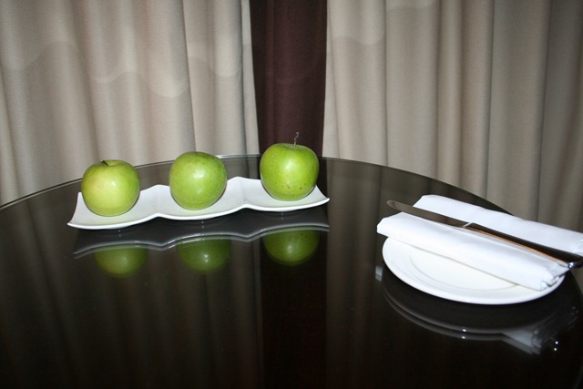
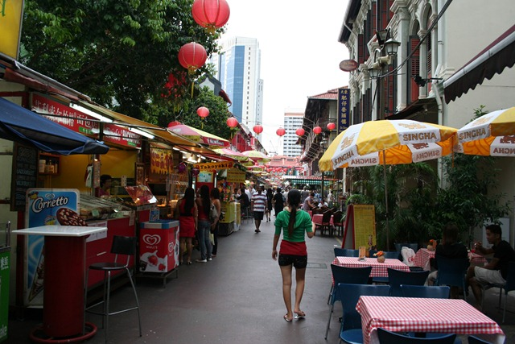
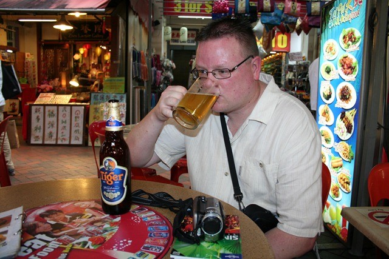

Onze eerste dag, de lange vlucht, zit erop. Singapore Airlines: “What a great way to fly”. Ruime zitplaatsen; 99 filmkanalen; Nintendo video games en, omdat het een lijnvlucht is, val je nog af ook in de 12 uur durende vlucht.

Vanmorgen om half zes plaatselijke tijd zijn we geland. Binnen 20 minuten zaten we al in de taxi op weg naar ons hotel. Het was toen al 28 graden en een vochtigheid van 99,999999%… Heerlijk zo’n natte deken om je heen. De chauffeur wist ons echter te vertellen dat we het treffen en dat het de komende dagen juist erg koel is.

We hebben een mooi hotel dichtbij Orchard Road. De kamers zijn juist afgelopen jaar gerestyled, dus we hebben een zeer nette, modern ingerichte kamer met allerlei nieuwe, technische gadgets. We hebben zelfs design appels …

Als we morgen weggaan, nemen we uit eentje lekker een hapje…

Na een aangename douche even een uurtje of 4 geslapen. Daarna werd het tijd om Singapore te verkennen. Eerste stop: een foodcourt op Orchard Road. Lekker Thais gegeten en daarna met de metro naar China Town.

Het wandelingetje dat de Lonely Planet aanraadde, viel een beetje tegen. Maar goed, het kan ook bijna niet anders. Zo’n beetje alles wat 10 jaar of ouder is, wordt afgebroken en vervangen door een mooie nieuwe wolkenkrabber. Dit is eigenlijk wel jammer, want hiermee halen ze ook de sfeer weg.

Het einde van de wandeling maakte echter alles goed. We kwamen uit bij het ChinaTown Complex waar ze allerlei leuke kleine winkeltjes, restaurantjes e.d. hebben.

Hier hebben we heerlijk rondgelopen en uiteraard weer lekker gegeten. Spring rolls gevuld met lekkere groentjes. Dan kan een Tiger Beer voor Roger natuurlijk ook niet ontbreken. Al dat wandelen en het vochtige weer maakt namelijk erg dorstig…

Aan het eind van de dag nog even lekker wat verkoeling opgezocht in het zwembad. Morgen nog een dagje Singapore en dan vervolgen we onze reis naar Down Under.

## 2 opmerkingen

### MacSprout 26 april 2010 om 08:56

Doerian wordt uitvoerig behandeld in het boekwerk "De scheepsjongens van Bontekoe" van Johan Fabricius....
Appeltje nog bewerkt voor vertrek?

### Anoniem 29 april 2010 om 12:47

Als Wow durian heeft gehaald in Amsterdam mag het van mij het huis niet in.
Dan leggen we het in de schuur. Over het algemeen gaan de buren dan na een paar uur vragen stellen in de trant van: "ligt er een overleden huisdier in jullie schuur?", of: "hebben jullie een industrieel-vet afscheider gekocht?"
