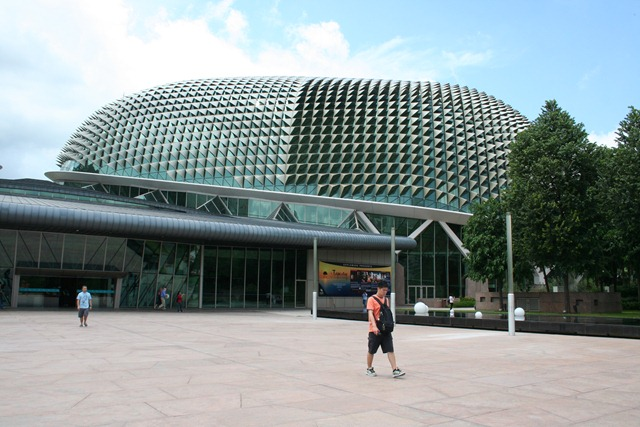

Vanmorgen hebben we lekker ontbeten en toen weer de hitte in. Met de metro zijn we naar de Esplanade gegaan: Singapores ultime eerbetoon aan de (bekende?) vrucht.

Het ding schijnt lekker te smaken maar ondanks dat mag je hem in geen enkel hotel of taxi mee naar binnen nemen. Hier zeggen ze: “Tastes like heaven, smells like hell”.

Bovenop het theater is een dakterras waar je een mooi overzicht hebt op de haven. En nog een voordeel: daar waait het lekker!

En oh ja, hadden we al gezegd dat het echt heel erg warm is? Zo te zien zijn ze in dit huis goed voorbereid…

Na de lunch nog wat gezwommen in het zwembad van het hotel, en nu zitten we op het vliegveld te wachten op de vlucht naar Darwin. Volgende berichtje komt dus uit Australia!

## 6 opmerkingen

### Nick Heinemans25 april 2010 om 13:04

Alvast een goede reis en een hele fijne vakantie!

Groetjes van Nick, Marjolein en Sanne

### Mac Sprout25 april 2010 om 22:56

"Down under" zal het wel wat koeler aanvoelen (niet zo vochtig). En dan zelf weer vochtig maken met Fosters/XXXX/Powers..... Veel plezier!

Ugh en How!
Martin

### David26 april 2010 om 11:06

Zat gisteren weer "smakelijk" te kijken naar het programma Border Security (australische douane). Neem eens wat van die vruchten mee naar Australië, komen jullie op TV! ;-)

### fam. van Kuil (junior)27 april 2010 om 22:22

Hele fijne vakantie jullie twee, wij kijken uit naar jullie verhalen!!!

Veel liefs Maurice en Dayenne
knuffels van de meisjes!

### MacSprout28 april 2010 om 13:45

En? De barbie al aan de praat gekregen met een flinke Skippy-Steak erop..... mmmmhhh..
Trouwens mocht je een croq tegenkomen deze zijn niet zomaar aan te trekken ... eerst fileren en de huid te drogen leggen... ;-0
Ugh en How!
Martin

### Gerard29 april 2010 om 00:00

Druk druk druk.....Heb vandaag pas voor het eerst kunnen kijken. Zo te zien hebben jullie het goed naar de zin. Veel plezier en pas op voor de slang....

Gerard
