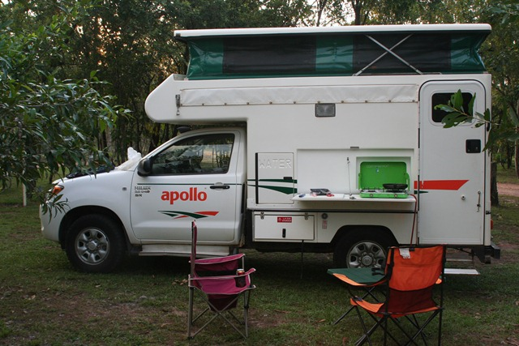

Daar is hij dan, ons eerste berichtje vanuit Australië!

Na een vlucht van zo’n vier uur zijn we maandagnacht om 02:30 uur geland in Darwin. We hadden al een hotel geboekt gelukkig dus konden we nog een paar uurtjes slapen voordat we de camper gingen ophalen. Na een wat karige uitleg zijn we rond 11 uur bij het verhuurbedrijf vertrokken met onze 4x4-vriend voor de komende vier weken. Het dak is uitschuifbaar en we moeten buiten koken: even een gasflesje aansluiten en koken maar!

Binnen is het wel een beetje behelpen met de beperkte ruimte, maar dat wisten we gelukkig van te voren. Stel je voor dat je met twee grote koffers komt aansjouwen… Bij binnenkomst kijk je tegen een bank aan, die je kunt ombouwen tot een eenpersoons bed. Boven het bestuurdersdeel hebben nog een uitschuifbaar tweepersoons bed. Dan hebben we nog een koelkast en (gelukkig!) een airco. Met name die laatste hebben we echt nodig, zo aan het einde van de regentijd: het is ongelooflijk heet en vochtig.

De eerste dag hebben we een beetje boodschappen gedaan en een stukje richting Litchfield National Park gereden: Berry Springs. Het dorp stelt geen ruk voor overigens, er is een camping en een tankstation, en er lopen wat verloren aboriginals rond.

## 2 opmerkingen

### David3 mei 2010 om 10:01

Wat een degradatie die camper ... vergeleken met de US ;-)

### fam. van Kuil (junior)7 mei 2010 om 22:15

Wat een grappig huisje!
