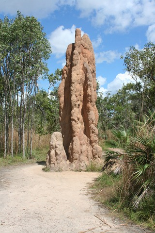
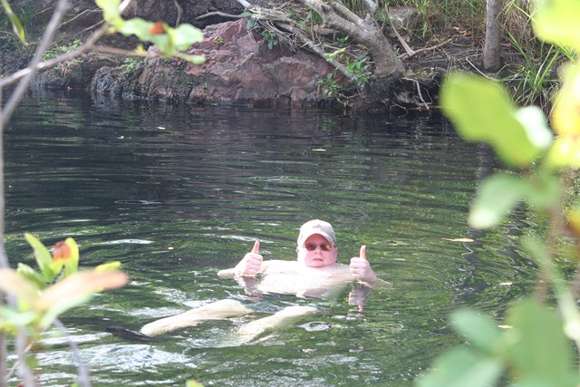

Dit park is volgens de locals hier een van de mooiste parken van Australië. Waar het met name beroemd voor is, is dat er heel veel poeltjes en stroompjes zijn waarin je kunt zwemmen. Een normale regel in dit deel van het land is dat je nergens mag zwemmen, tenzij aangegeven staat dat het wel mag: we zijn tenslotte in crocodile-country!

De eerste dag hebben we de Termite Mounds bezocht. Dit is een bouwwerk om de temperatuur zo gelijkmatig mogelijk te houden, sommige zijn meer dan 3 meter hoog! In dit deel van het park staan honderden van dit soort bouwwerken, allemaal perfect op de noord-zuid as gericht, om zo optimaal mogelijk gebruik te maken van de zon.

Daarna zijn we naar Walker Creek gewandeld, en lekker gezwommen in een riviertje.

## 1 opmerking

### Anoniem5 oktober 2010 om 19:12

What the fuck, ligt een croc met een pet op in de creek!

Ben V uit S.
