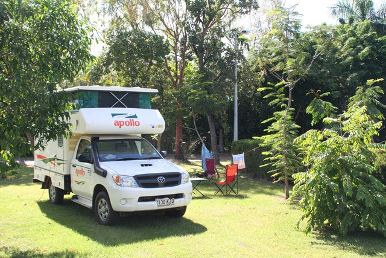
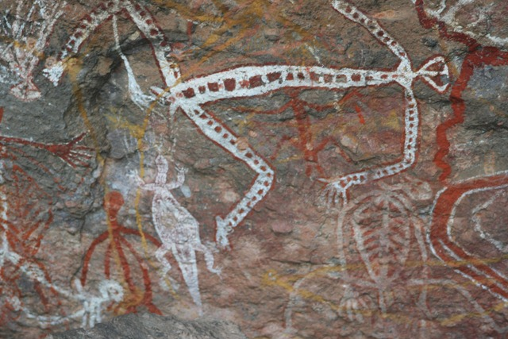
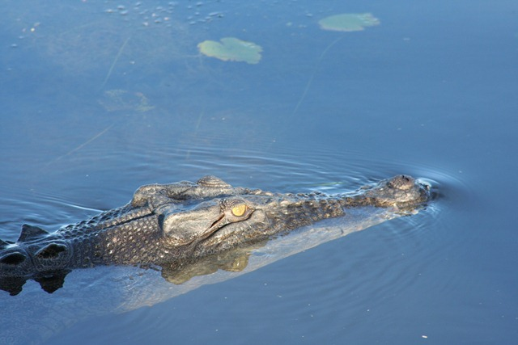
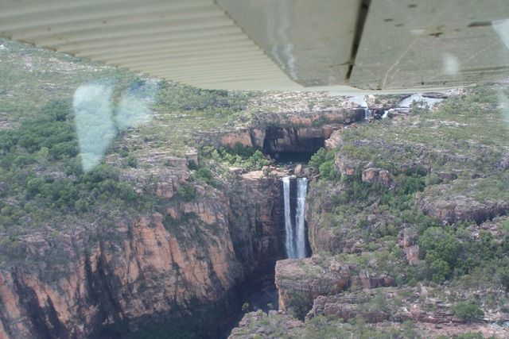

Dit nationale park is het op 1 na grootste van de wereld, het is qua oppervlakte ongeveer de helft van Zwitserland. We hadden een heel mooie camping hier, met een zwembad en restaurant in het midden en daarom heen alle kampeerplekken. We zijn in totaal drie nachten hier gebleven.

Een groot deel van het park loopt tijdens het wet-season onder water en dat betekent dat nog veel wegen gesloten zijn. Wel hebben we rock-art bezocht van de Aboriginals…

en zijn we op krokodillenjacht geweest op een cruise ‘s morgens in alle vroegte…

Deze knaap bleef een hele tijd naast onze boot zwemmen. Volgens de gids zijn zoutwaterkrokodillen (die ook in zoet water voorkomen) vanaf 2 meter lengte gevaarlijk en overleef je een aanval vrij waarschijnlijk niet. In Kakadu zit de hoogste concentratie van zoutwaterkrokodillen ("Salties") van Australië.

Op de dag van vertrek hebben we ‘s morgens nog een rondvlucht gemaakt in zo’n ieniemienie vliegtuigje. De mensen achter ons stonken naar natte hond en de piloot naar zweet, maar de uitzichten waren waanzinnig.

## 2 opmerkingen

### Anoniem3 mei 2010 om 13:58

~R.

Weet jij nog op welke server je het restore probleem met TDP had? Wij (Joost en ik) willen een upgrade van de clientsoftware gaan doen, maar daarvoor hebben we wel een servernaam nodig.

Alvast bedankt.
Oja, nog even voor de vorm: poeh poeh poeh zeg, wat een leuke vakantie hebben jullie daar. We waren er net zo erg aan toe als jullie.

Dag.

Ronald

### Anoniem3 mei 2010 om 14:01

Wel een klein campertje hebben jullie daar zeg.
Passen jullie ego's daar wel in?
