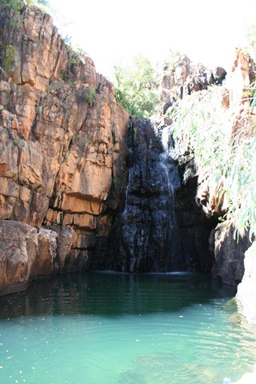
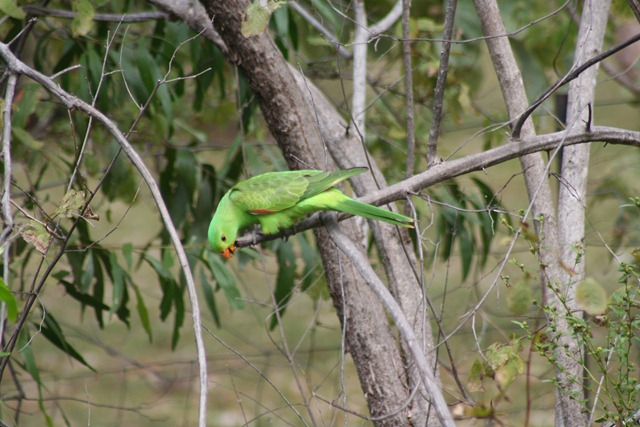
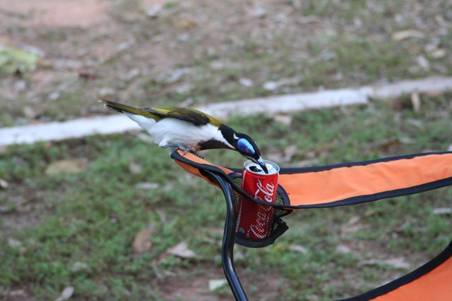

Afgelopen dagen in National Park Katherine Gorge doorgebracht. We hebben op de camping van het park overnacht. Deze was voorzien van een prachtig zwembad met Bistro waar je heerlijk kon eten. En wij dus ook heerlijk gegeten hebben…

We hebben een mooie wandeling gemaakt naar de eerste Gorge en de enige plaats waar je kon zwemmen. Op alle andere plekken zaten nog Crocodilians. De wandeling op zich was niet zo spectaculair, maar het uitzicht over de Gorge was prachtig!

En niet te vergeten de verfrissende duik in het pooltje (uiteraard met waterval) was ook niet ongewenst na 4 km door 40 graden te hebben gelopen.

Daarnaast groeien de papegaaien hier in het wild. Er zijn er net zoveel als er bij ons mussen zijn. Ik vraag me af of ze als het nog warmer wordt ook van het dak af vallen.

Op de camping is ook enorm veel wildlife. Ze komen zelfs ongenodigd op het eten. En voor je het weet drinken ze je cola op…

## 1 opmerking

### Anoniem8 mei 2010 om 21:24

Hey hey, geen cola light?
