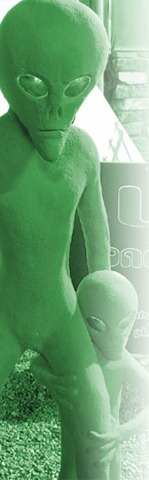

We staan vandaag op de meest wazige camping die ik ooit heb gezien. Volgens de Lonely Planet zijn in de bar minstens 40 soorten bier te krijgen, dus zijn we hier gaan staan. Het plaatsje Wycliffe Well is de UFO hoofdstad van Australië, en de eigenaar is er heilig van overtuigd dat hij binnenkort wordt ontvoerd door aliens… Hij beweert ook dat hij regelmatig UFO’s ziet vliegen, maar ik denk persoonlijk dat dat meer te maken heeft met de enorme voorraad bier in z’n bar.

Camping is overal voorzien van aliens en ruimtevaartuigen…

