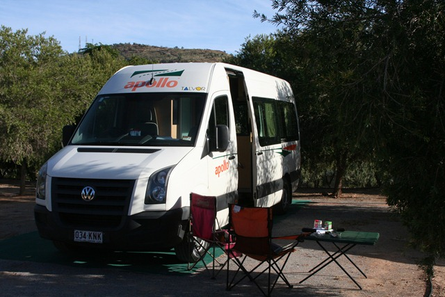

die 4x4 gingen rijden? Nou, die gingen niet!

Sinds de eerste dag brandt er een lampje op ons dashboard. Volgens het boekje van de auto moet je direct naar de Toyota dealer, volgens Apollo (de camperverhuurder) is het geen enkel probleem en is het een vervuilde sensor in het uitlaatsysteem. “No worries mate; It’s a Toyota so it will keep on driving”. Maar eergisteren kwamen we toevallig langs een Toyota garage en daar hebben we de auto toch maar even aan de computer laten hangen. Diagnose: de brandstofpomp heeft een “grote” lekkage. Volgens de monteur kan het ding het nog de hele vakantie doen, maar hij kan ook over 100 meter echt kaputt gaan. Dus Apollo gebeld, en we kunnen de camper in Alice Springs (nog ruim 600 km verder naar het zuiden) omruilen.

Dus dat hebben we maar gedaan. Helaas hadden ze geen 4x4 meer, dus nu rijden we in een enorme Volkswagen bus van 7 meter. Maar het goede nieuws is wel dat we nu weer een douche, toilet en magnetron aan boord hebben. 't Is een mooi ding, rijdt super en het is een automaat. Ook dit ding rijdt op diesel, volgens de mannen van Top Gear Satan’s fuel. Helaas moeten we wel onze plannen enigszins bijstellen, maar ja er is genoeg moois te zien in dit land dus dat zal wel lukken.

We vertrekken zometeen richting Uluru, beter bekend als Ayer’s Rock. Dus richting The Red Centre.

## 4 opmerkingen

### David 6 mei 2010 om 06:40

Tja, is net zo iets als een lampje in een Lexus ... voor je het weet rij je opeens een Renault :-P

### Anoniem 6 mei 2010 om 10:08

Lamjes in Lexi gaan nooit stuk, want die hoeven niet te branden.
Waarschuwingslampjes in Renaults daarentegen branden regelmatig door.
Of versnellingsbakken.......

Wel jammer dat er weer zeik is met jullie wielen, zou het liggen aan het feit dat het huurbakken zijn?

Grt,
Ronald

### fam. van Kuil (junior) 7 mei 2010 om 22:14

Dag Hikers! Even bij moeten lezen sinds maandag! Tjonge jonge jullie treffen het wel met jullie mobiele huisjes! Maar goed dat er weer een ander en zelfs luxer huisje voor jullie klaar staat, hahah. Ik zie en lees dat jullie je daar prima vermaken.... Veel plezier en geniet!!!

Wij hebben ook een schitterend midweekje doorgebracht. Kinderen hadden het goed, dan hebben wij dat uiteraard ook ;)

Liefs van ons!

### Gerard 8 mei 2010 om 09:58

Hallo Chantal en Roger,

Ook wij zijn weer terug op ons eigen honk en na een weekje toch wel erg achterop geraakt met het bijhouden van de blog. Het is toch wat met Toyota de laatste tijd..... Nu rijdt je Duitse gründlichkeit..... De reis is zo te zien de moeite waard. Veel plezier nog en doe de groeten aan de kruising van hazewindhond en haas.

Doei....
Gerard
