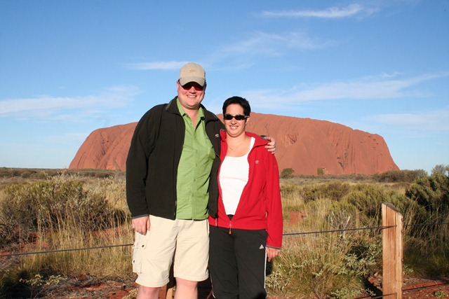
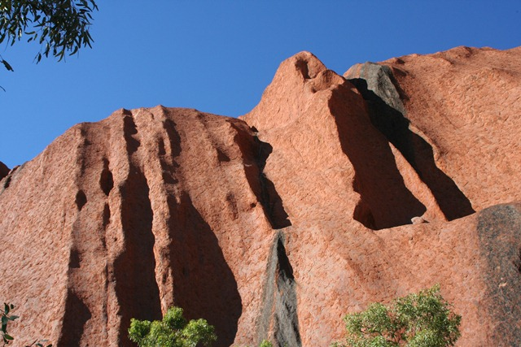

Eigenlijk moet je die rare pukkel Uluru noemen, dat willen de Aboriginals graag, dus dan doen we dat maar. Vanuit Alice Springs (1500 km zuidelijk van Darwin) is het nog maar 4,5 uurtjes rijden naar Uluru. Het is heel raar: je rijdt 400 km door een vrijwel vlak landschap en dan ineens rij je tegen een rode muur aan.

Voor de Aboriginals heeft Uluru een sterke religieuze en spirituele betekenis, dus uit respect daarvoor zijn we er niet bovenop geklommen. Of zoals een Nederlandse mevrouw zei: "In Nederland klim je ook niet op het altaar in een kerk". En zo is het maar net!

Verder is er rond de berg niet zo heel veel te doen, we hebben de zonsondergang bekeken (samen met 3 miljoen anderen), en een beetje rond de berg gelopen.

Onderaan zijn veel grotten waar de Aboriginals allerlei rituele zaken uitvoeren, en die mogen dan ook niet gefotografeerd worden.
