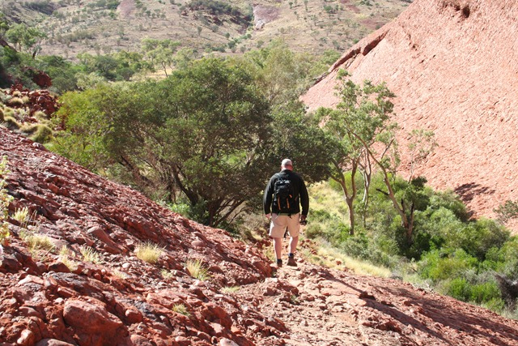
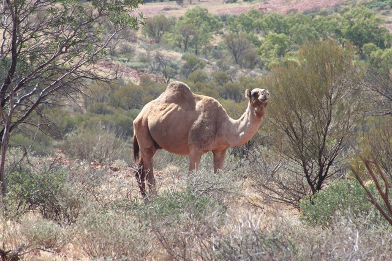

50 kilometer westelijk van Ayers Rock heb je nog zo’n raar uitstulpsel met de naam The Olgas. Hier kun je heel mooi wandelen, ook al omdat het hier nu winter is en overdag niet veel warmer wordt dan 25 graden. We hebben de Valley of the Wind gelopen, zo’n 8 kilometer.

Af en toe moesten we behoorlijk klimmen, maar de uitzichten waren heel mooi. Wat ik niet wist, is dat in Australië heel veel kamelen voorkomen, dus je kunt je mijn gezicht voorstellen toen we tijdens de wandeling tegen eentje aanliepen :-)

## 1 opmerking

### David 10 mei 2010 om 13:40

Kamelen? je bedoelt dromedarissen (tenminste op de foto)
