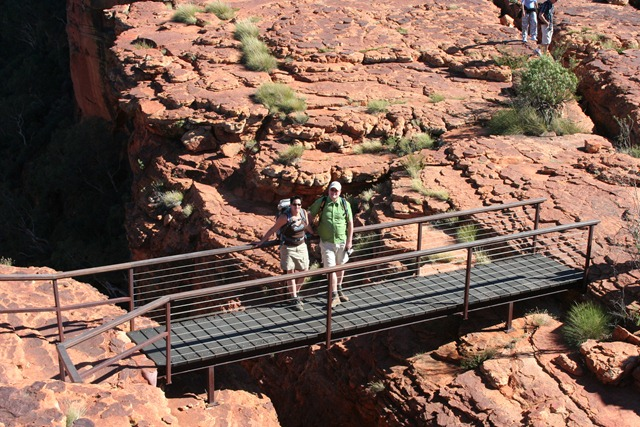
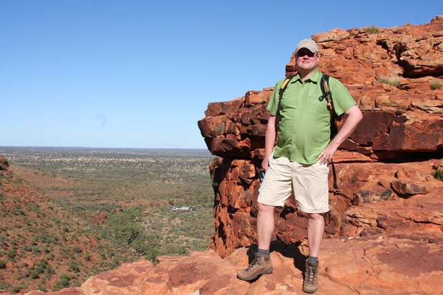

Zet in the middle of knowhere een schuur neer met een BBQ en een bandje, een paar lange tafels en banken, een paar liter bier en je hebt FEEST. We hebben dit meegemaakt in Kings Canyon. Die Aussies kunnen er wat van zeg!

Maar wij komen natuurlijk voor serieuze zaken: de Canyon Rim Walk. Volgens Lonely Planet een van de mooiste wandelingen die je in de Northern Territory kunt doen. En ik denk dat ze gelijk hebben!

Vanmorgen hebben we nog een quad-tour gedaan, en toen weer terug gereden naar Alice Springs. 's Middags hebben we twee fietsen gehuurd en door 't stadje gefietst en wat boodschappen gedaan. Morgen gaan we weer de rimboe in...
