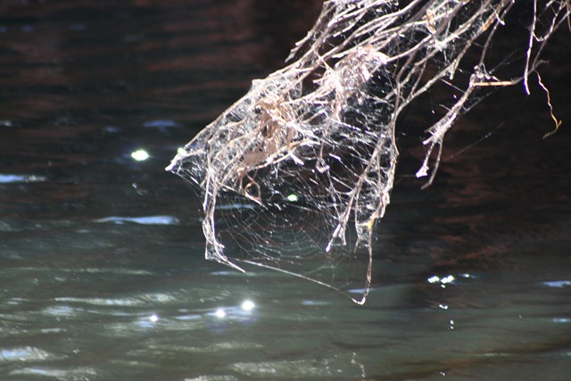
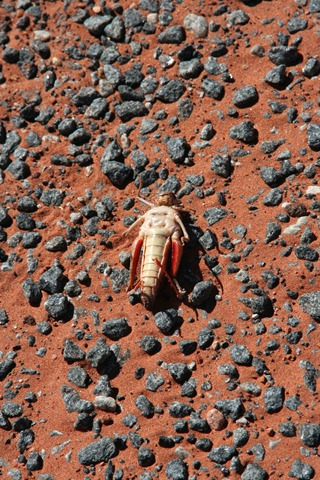
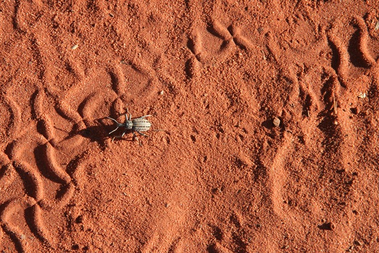
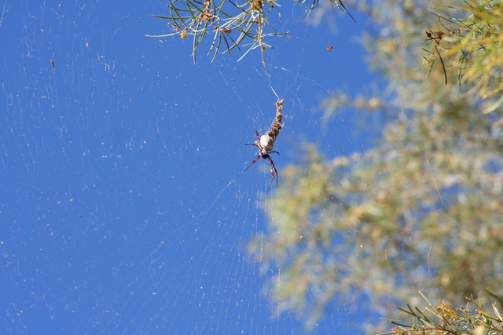

Ik moet eerlijk bekennen dat ik nogal angstig was met betrekking tot De Beestjes in Australië. Maar tot nu toe zitten ze alleen maar op de plekken waar ze horen: in de natuur, langs de weg en natuurlijk in de toiletgebouwen op de campings.

Nee hoor, dat laatste valt reuze mee. Hoewel, Chantal heeft vorige week wel onbewust op een kikker gepiest... Nou ja, dan moet je je ook maar niet verstoppen in een dames toilet he.

Dit spinnetje heeft een behoorlijk lijf, ik schat zo’n 5 centimeter. Maar wat echt spectaculair is, is zijn web: we hebben ze gezien van zo’n drie meter breed!

## 4 opmerkingen

### Je collega ;-)11 mei 2010 om 11:12

Hey Roger,

heb je nog aan ETL gedacht??

### Anoniem11 mei 2010 om 11:15

Je kan beter aan de "Red-back Spiders" denken hoor. Deze zijn klein maar zeer giftig.... en bevinden zich ook graag in toiletten... dus Chantal wel overheen piesen maar niet op gaan zitten....

Gr. MacSprout

### Je collega ;-)11 mei 2010 om 11:17

Bedoel je niet toevallig de ETL-Back Spiders ;-)

Kan je ook overheen piesen natuurlijk.....

### Anoniem13 mei 2010 om 11:38

Allemaal beestjes, dus.
Zo te horen geen last van de mozzies.
Wou dat ik bij jullie tussen de dieren stond. Ik moet het nu doen met Australian Wildlife op een pannelap. Hoe is het bier?

Greetz
