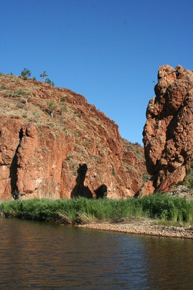
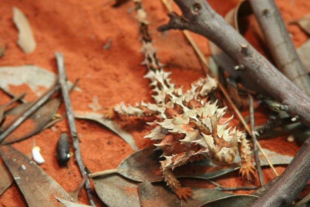
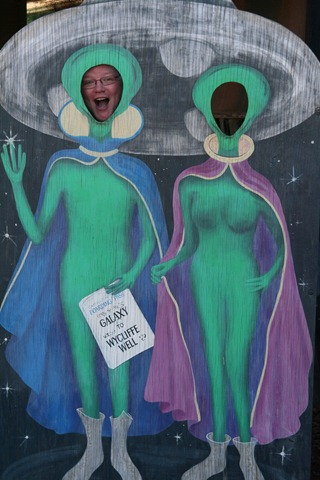

En we zijn weer terug in de buurt van Alice Springs! Iets ten westen van Alice Springs liggen de MacDonnel Ranges. Hier hebben we twee dagen rondgereden en een paar korte wandelingetjes gemaakt.

In het Desert Park in Alice Spings kwamen we deze jongen nog tegen…

Daarna zijn we weer richting het noorden vertrokken en hebben we weer overnacht bij die gesjeesde campingeigenaar met z’n aliens...

