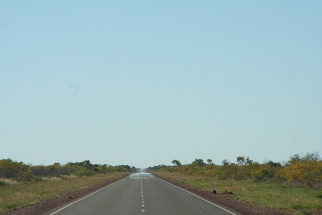

Ruim 5 uur noordelijk van Alice Springs is de afslag naar het oosten, we moeten immers langzaam richting Cairns gaan; volgende week vrijdag moeten we de camper daar inleveren.

Mount Isa is een behoorlijke stad, naar Australische maatstaven dan; wij zouden het gewoon een dorp noemen. Hier is veel mijnbouw en wij hebben dan ook een mijn bezocht. Niet een echte, maar een museum! Maar ze hebben goed hun best gedaan er iets van te maken: in volledige uitrusting zijn we in een lift 25 meter onder de grond gebracht en toen in een treintje een stuk gereden. Daarna kregen we uitleg over allerlei machines die men vroeger gebruikte. Tegenwoordig doen ze het volgende de oud-koempel allemaal met computers en zitten ze in een van airco en DVD speler voorziene cabine een boek te lezen en verdienen die gasten 140.000 dollar per jaar (zo’n 110.000 euro).

En daar was de toeristenval weer: helaas mogen er geen foto- en filmcamera's mee ondergronds. Maar gelukkig werd er een foto van je gemaakt, die je dan achteraf kunt kopen... een beetje zoals in de Efteling.

Mafia, dat is 't!

Maar goed, na de mijn zijn we maar naar het volgende gat gereden: Cloncurry. Het zegt genoeg dat de lokale VVV in 2010 nog steeds prat moet gaan op het feit dat ze hier in 1889 de hoogst waargenomen temperatuur in Australië hebben genoteerd: 53,9 graden Celcius. Verder is hier geen ruk te beleven. Zelfs de camping heeft faciliteiten uit de tijd dat de maliënkolder nog in de mode was.

Vandaag rijden we zoals gezegd verder naar de oostkust, een ritje van slechts 800 kilometer. En ik vrees dat het weer 800 kilometer rechtuit gaat worden, door een enerverend landschap van zand, gras, af en toe een struik en een dode kangoeroe langs de weg.

## 3 opmerkingen

### Gerard 15 mei 2010 om 10:57

Hallo You2,

Misschien hebben ze zich vergist en bedoelen ze wel 53,9 graden Fahrenheit, ze wisten allen niet meer de naam van die man. Toch wel lastig als je al weer moet gaan denken aan het inleveren van het home on wheels zeker als je zoveel leuke dingen doet. Geniet er nog maar lekker van.

Groetjes

Helen & Gerard

### Anoniem 17 mei 2010 om 08:18

Doen wij toch iets verkeerd, de computer-airco-dvdspeler zijn bekend maar het bijbehorende salaris..... misschien ook maar foto's gaan verkopen. :-)

Voordeel van die rechte wegen is dat je naast de cruise-control ook het stuurwiel vast kan zetten.

Ugh en How!
Mac

### Anoniem 18 mei 2010 om 13:21

Een ander voordeel van zo'n lange, rechte en vooral saaie weg is dat het een geruisloze overgang naar Nederland is......

Grtz,

Ronald
