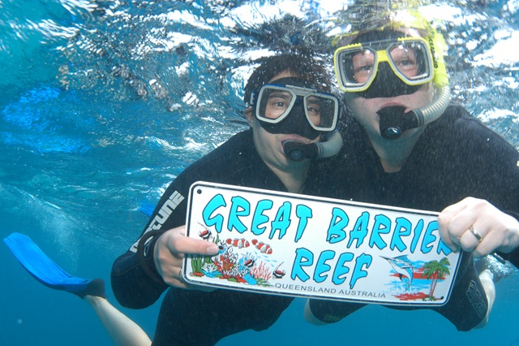
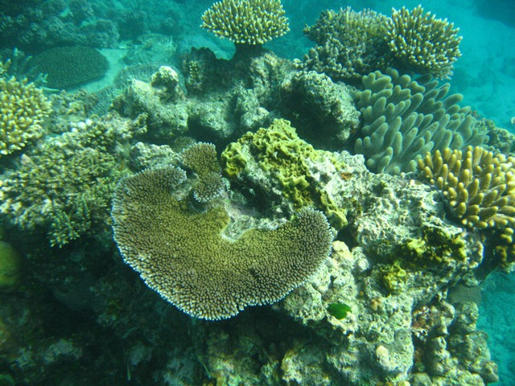
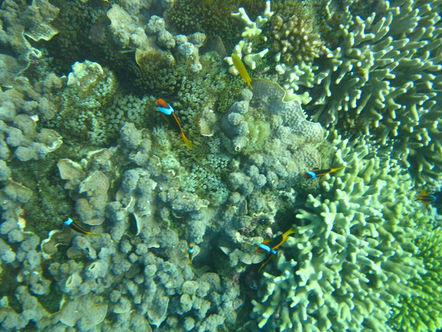

Nee hoor, niet weer problemen met de camper :-)

De Batentjes zijn inmiddels in Cairns, aan de oostkust, onze laatste stop deze reis :-(

We zijn vandaag met een boot naar het Great Barrier Reef geweest en daar gesnorkeld. Veel mooie visjes en koraal gezien, en ook twee haaien. Kleine weliswaar (een kleine meter lang), maar toch… het zijn haaien!

We hadden speciaal voor deze touroperator gekozen omdat zij ook duikbrillen op sterkte hebben. Voor het eerst heb ik goed kunnen kijken onder water! Voorheen was het altijd een licht gekleurde vlek in een blauwe wereld.

We hebben ook een onderwatercamera gehuurd, resultaat daarvan zie je hieronder.

Nemo!!!!

## 1 opmerking

### Anoniem18 mei 2010 om 13:25

Zag ik daar niet Natalee Holloway liggen? 2e Foto, achter Nemo's linkervin......

Grtz,

KPN
