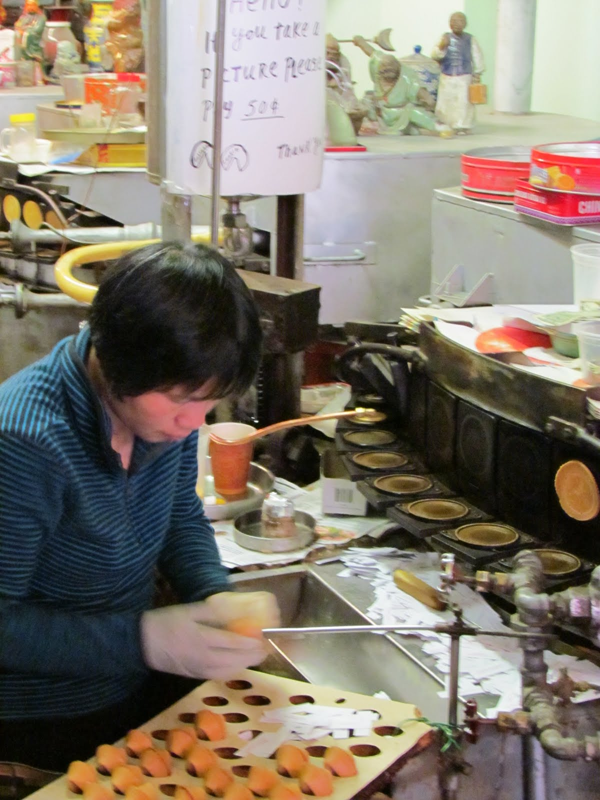
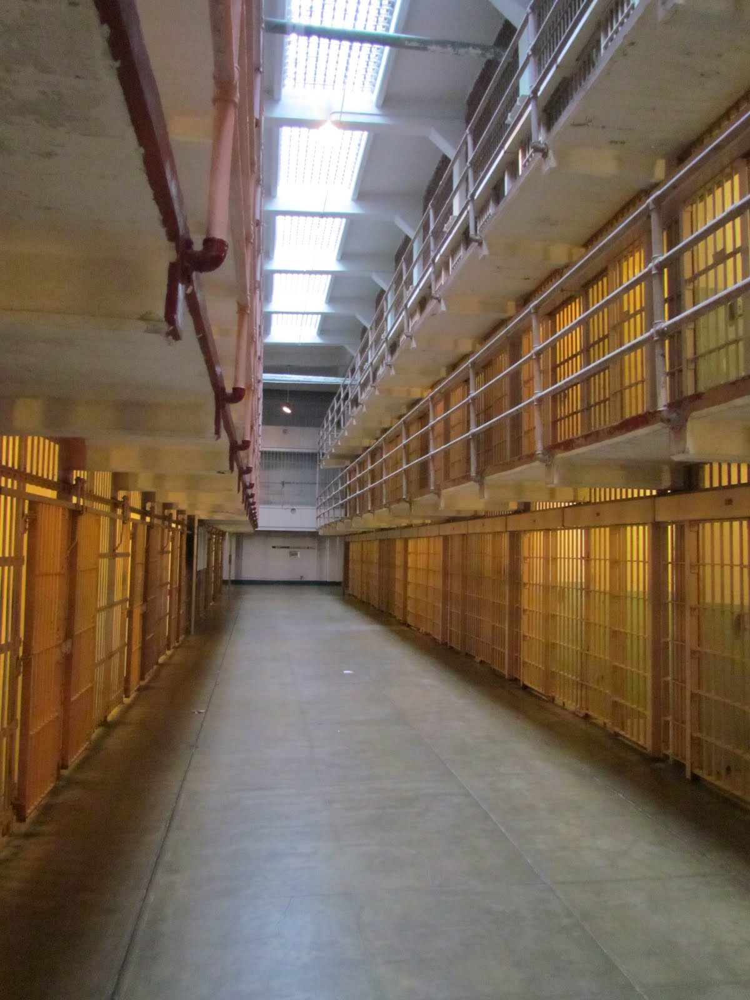

Zo, de eerste dag zit erop.

Tot een jaar of 10 geleden was Chinatown een smerig en vervallen deel van San Francisco. Er is toen een aantal (burger)initiatieven ontstaan om de boel op te gaan knappen, om zo van het slechte imago af te komen. Een van die initiatieven was om rondleidingen door de stegen van Chinatown te laten verzorgen door jongeren die er geboren en getogen zijn. Wij zijn vandaag meegeweest met zo'n rondleiding. Onze gidsen waren net geslaagd van highschool, maar ze deden het erg goed en de wandeling was heel leuk. We zijn nog bij een fabriekje geweest waar fortune cookies gemaakt worden. Die dingen komen dus helemaal niet uit China! Sterker nog, ze zijn ooit uitgevonden door een Japanner die in Golden Gate Park een theehuis had, en die zijn gasten wilde bedanken voor hun komst.

Na de lunch zijn we weer even teruggegaan naar het hotel. Precies voor de ingang van het hotel is een halte van de Cablecars. Die dingen zijn echter zo populair onder toeristen, dat je eigenlijk alleen bij een beginpunt van de lijn kunt opstappen. Dus wij even naar het beginpunt gelopen, staat daar een rij waar ze in de Efteling nog jaloers op zouden zijn! Terwijl we achteraan aansluiten, komt er een naar drank ruikende zwerver (pleonasme?) naar ons toe, en hij zegt dat ze de wagentjes maar tot de helft vullen, en dat we dus naar de eerstvolgende halte moeten lopen. Dan ben je binnen 2 minuten onderweg. Nou, dat was een goede tip! Die knakker zei toen wel dat hij voor die tip een fooi wilde hebben. Daar heb ik dus een hekel aan, dus ik loop weg. Komt die knakker achter me aan zeg! "You fuck! You German Bitch!" Hahaha, dus toen kreeg hij helemaal NIKS meer :-)

Al met al waren we nog net op tijd voor ons bezoek aan Alcatraz...

Behoorlijk beklemmend allemaal daar, en zeer indrukwekkend. Je zal d'r maar zitten. Maar ja, je kwam er natuurlijk ook niet zomaar te zitten.

## 3 opmerkingen

### Gerard 13 juni 2011 om 00:38

Hallo Vakantiegangers,

De eerst dag zit er op en al veel moois gezien en toch ook de eerste scheld partij. Gelukkig dat het "pleonasme" niet weet over wie hij het heeft, zijn uitlatingen kloppen van geen kant. Ik heb via Google-maps even in de straat van jullie hotel gekeken, erg leuk.
Trouwens mijn eerste reactie op de blog hangt nog ergens in "toestemmingsland"
G & G dwz groetjes en geniet ze
Mams en Paps

### Anoniem 13 juni 2011 om 09:27

Hoi Roger en Chantal, mooi dat jullie er zijn. Ik hoop dat het zonnetje schijnt, want het kan daar lekker mistig zijn. Oh ja, de zwerver is geen pleonasme, want hij kan natuurlijk ook naar zweet stinken is niet altijd drank. :-)
En nu denk ik de RV ophalen? en naar Sausalito?

Groeten, Ben

### fam. van Kuil (junior) 13 juni 2011 om 17:55

Leuk welkom van die aardige meneer van de straat!
Wat grappig dat die cookies dus helemaal niet uit china komen, altijd gedacht! Ik heb het filmpje gezien en het klinkt inderdaad heel koud en kill in de gevangenis! Het zal een aparte maar indrukwekkende ervaring geweest zijn! Ben benieuwd of jullie nog gaan fietsen! haha
Heel veel plezier saampjes en GENIETEN!

Liefs Maurice en Dayenne
