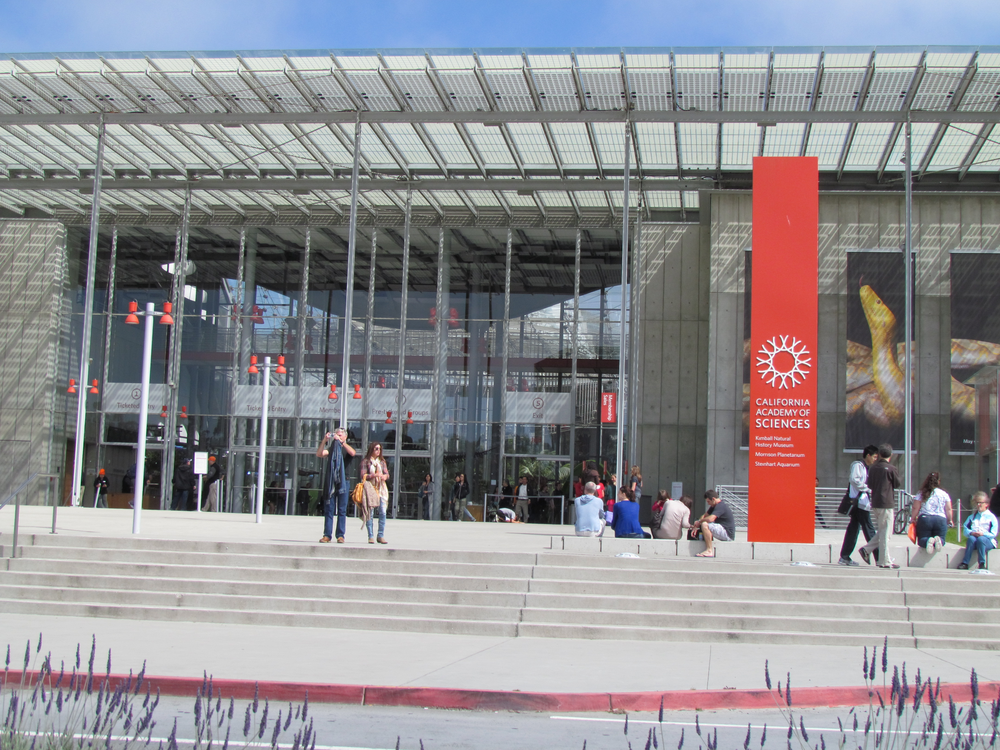
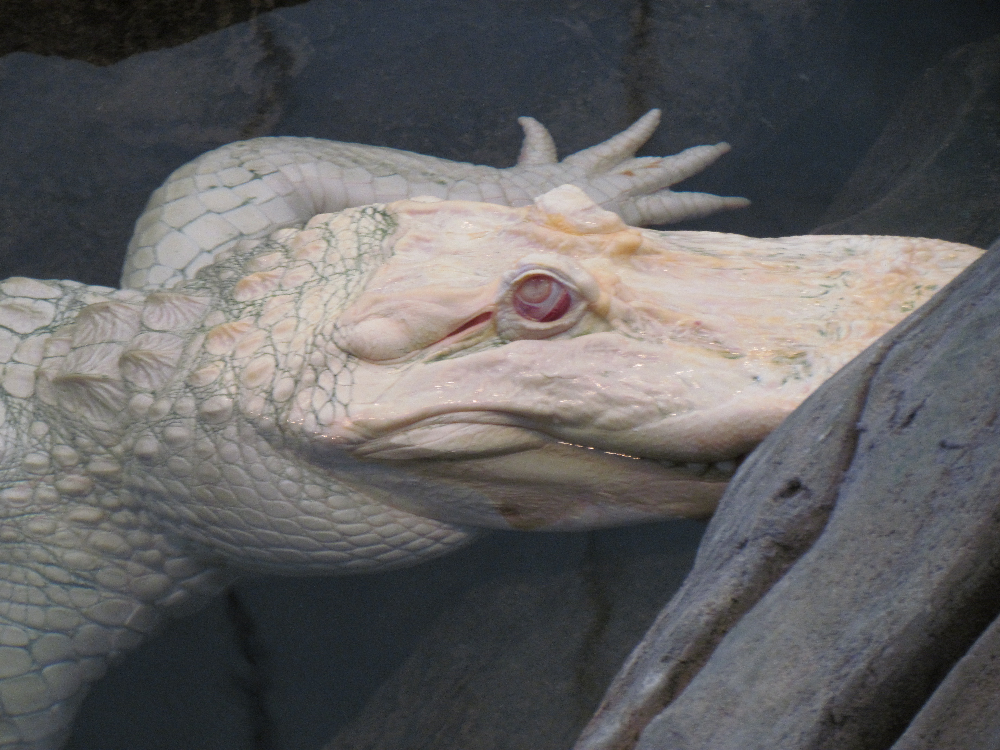
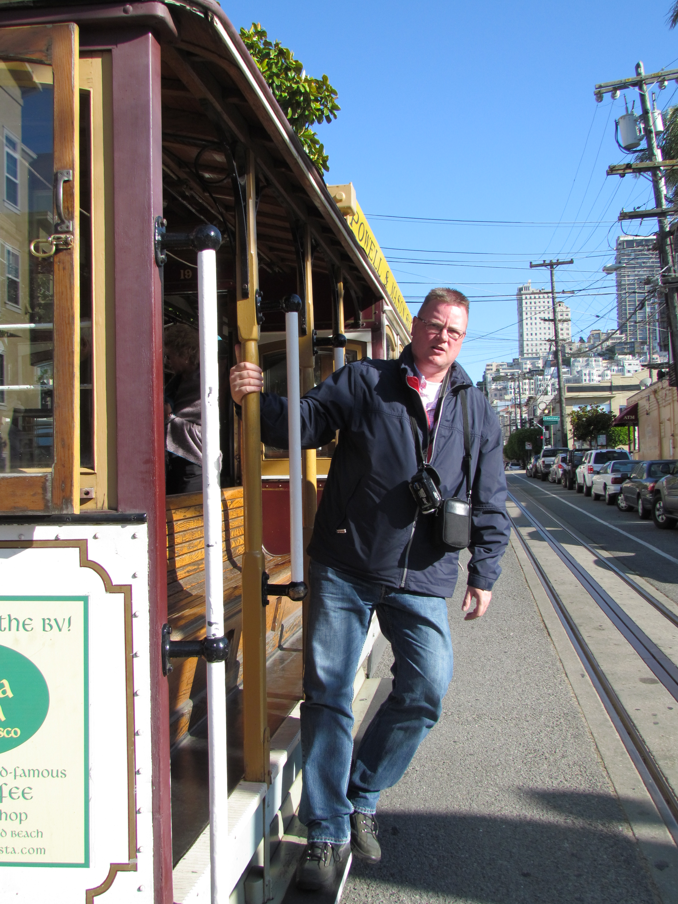

Gisteren zijn we met de bus naar de California Academy of Sciences, volgens Lonely Planet een "not to miss" attractie, midden in het Golden Gate Park. Ik heb dus altijd gedacht dat dit park aan het begin van de Golden Gate brug lag, maar dat is dus helemaal niet zo. Het was bijna een uur met de bus! Wij waren zeer enthousiast over hetgeen ze lieten zien. Het was allemaal heel erg Amerikaans opgezet, maar dat zijn de meeste dingen hier natuurlijk :-)

Bij binnenkomst moet je onder een enorm skelet van een dinosaurus lopen. Midden in de enorme hal is een soort reuzen-ei met daarin een nagemaakt tropisch bos, compleet met kleurrijke vlinders en vogels. In een soort spiraal loop je dan van de bodem naar de toppen van de bomen, en kun je onderweg alle planten en insekten bekijken. Ook hebben we in een Imaxtheater een film bekeken over het ontstaan van het leven op aarde. Was zeer indrukwekkend!

Ook hebben ze een albino-krokodil, die in de natuur uiteraard niet kan overleven.

Na de middag zijn we weer naar Fishermans Warf gegaan, met de cablecar.

## 1 opmerking

### Gerard 14 juni 2011 om 11:47

Hallo Chantal en Roger.
Wat een pokdalige kop heeft de albino. Het lijkt wel erger dan die van de gekleurde versie.
En Roger, als de camera er niet was, lijkt je wel een echte Amerikaan zoals je op de tram staat, klaar om af te stappen.
G&G
Mams en Paps
