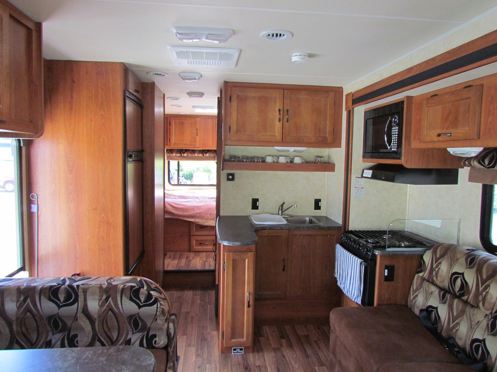
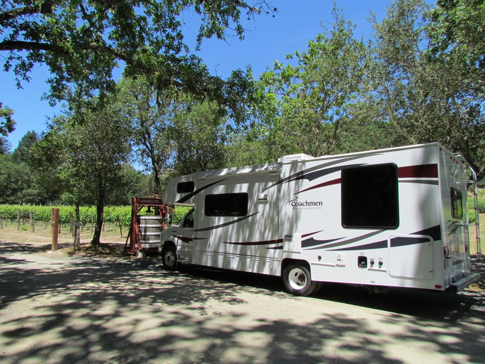

Heel gek, maar de afgelopen dagen in San Francisco hadden we beiden niet het idee dat we aan de andere kant van de wereld zaten...

Maar nu we de camper hebben opgehaald is dat gelukkig veranderd. Eindelijk hebben wij ook eens een keer geluk, we zijn namelijk de tweede huurders van het ding. Hij ruikt nog helemaal naar nieuwe auto. Alles lijkt te werken, meer dan voldoende opbergruimte, dus tot nu toe geen enkele klacht. De motor is een V10, 5 punt zoveel liter en ongeveer 13 PK. Haha, dat laatste zal niet helemaal kloppen denk ik.

We hebben een TomTom aan boord en een tv en douche, en een toilet, en een kelder voor alle bier, BBQ (Smokey Joe van Weber voor 29 dollar bij de Wallmart!) en een hele voorraad briquetten.

Bij de vorige RoadBear die we huurden liep de achterkant van de camper bij het minste of geringste hobbeltje aan de grond. Met name bij supermarkten en tankstations was dat altijd een ellende, maar dat hebben ze schijnbaar bij dit model opgelost. Chantal is helemaal in d'r nopjes met de camper, we hebben zelfs bergruimte over!

Uiteindelijk zijn we net buiten San Francisco beland, in Napa, dus winecountry!

Morgen maar eens kijken wat hier allemaal te beleven valt.

## 2 opmerkingen

### Sergio 16 juni 2011 om 09:14

Wat een groot ding!
Veel plezier verder!
Sergio

### fam. van Kuil (junior) 22 juni 2011 om 14:12

Wat een gave mobile home! De kinderen vinden het fantastisch wat koetjeboe te vertellen heeft..
Laat de vakantie maar lekker door je heen waaien zodat je heerlijk kan geniet van al het moois, wij lezen jullie avonturen wel!

Liefs van ons
