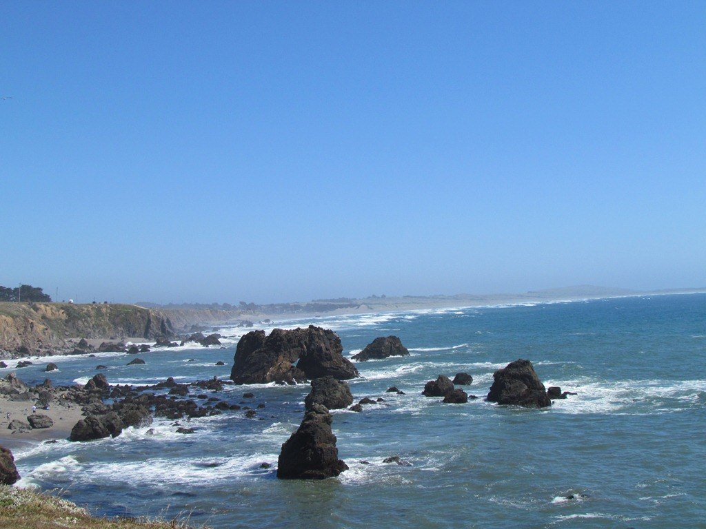

Vanuit Napa hebben we 's morgens een scenic route gereden door de wijnvelden en natuurlijk zijn we nog wat wijn gaan proeven. Auto's, koffie en bier kunnen ze niet maken hier in de USA, maar wijn gaat ze toch heel aardig af. We hebben een stuk of 6 wijnen kunnen proeven, en die smaakten eigelijk allemaal heel behoorlijk.

En toen zijn we weer richting de kust gereden. Wat is die highway one toch ongelooflijk mooi zeg. Schiet voor geen meter op, maar dat hoeft ook helemaal niet. De westkust is enorm ruig, en noordelijk van San Francisco ook helemaal niet druk meer. Wel staat er continu een harde (en koude!) wind.

Na een overnachting op een camping in een state park, een aardige wandeling in Van Damme State Park, zijn we vanmiddag aangekomen in Fort Bragg.

Hier rijdt een stoomtrein een stuk het binnenland in, eens kijken of we morgen een stukje kunnen meerijden.

## 1 opmerking

### Gerard 16 juni 2011 om 11:02

Hallo Daar,
Jullie mogen zeker wel in je sas zijn met die luxe camper. Wat een ding! Dit rijdt natuurlijk prachtig. De route is erg mooi en we maken zo nu en dan ook even een uitstapje via Google maps. Je krijgt dan een beter beeld van hetgeen jullie zien en beleven.
g&g
Mams en Paps
