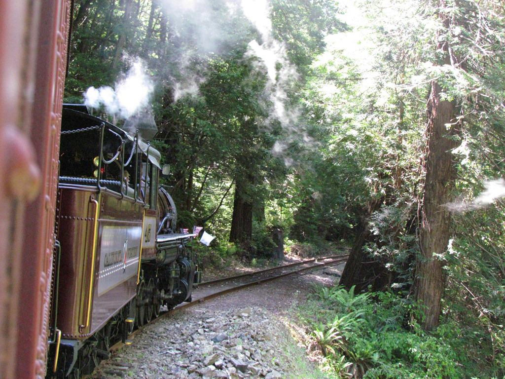
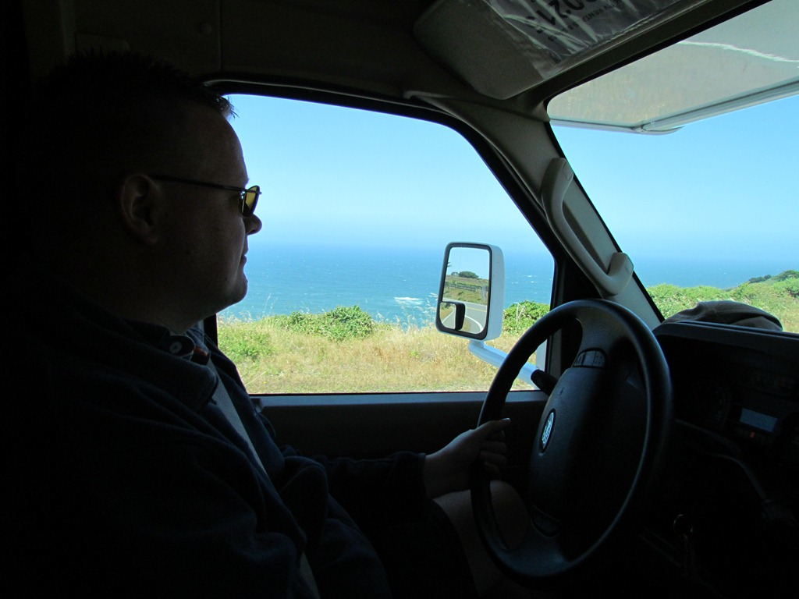

Gelukkig konden we nog mee met de stoomtrein, ik was helemaal in m’n nopjes. Normaal gesproken is op dit soort treinreisjes het gehalte ~~liefhebbers~~ bejaarden erg hoog, maar dat viel deze keer echt mee.

De trein vertrok vanuit Fort Bragg en rijdt in anderhalf uur naar Northspur, alwaar we midden tussen de redwoods van een (niet zo’n heel goede) bbq konden genieten. Het ritje was best mooi, en ondanks dat de wagons uit 1920 kwamen, ook behoorlijk comfortabel.

Nadat we weer terug bij de camper waren, zijn we weer verder gereden naar het noorden. Highway One wordt alleen maar mooier en mooier. Als je ooit de kans hebt en hier in de buurt komt, moet deze weg zeker een keer rijden.

