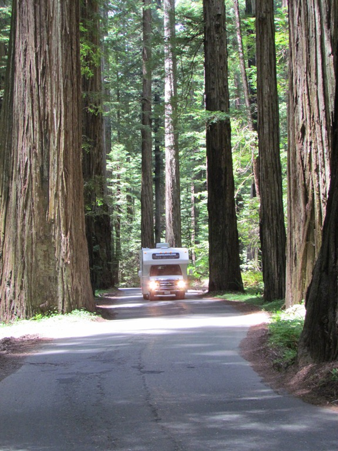
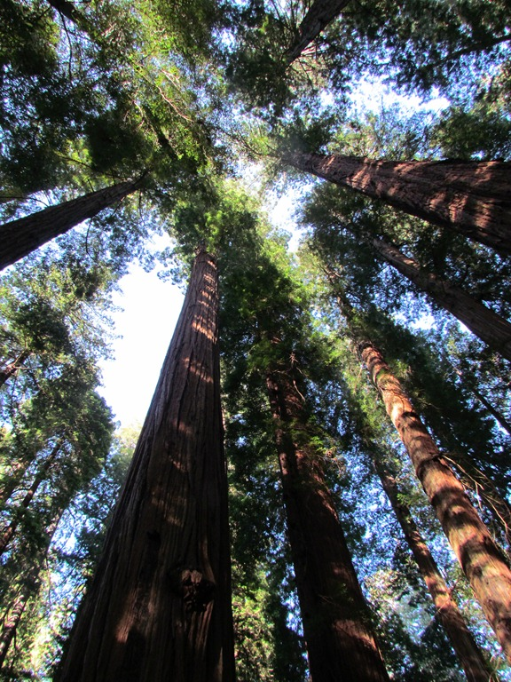

De Avenue of the Giants is een 50 km lange "scenic route" die parallel aan de snelweg door het grootste aaneengesloten woud van Redwoods loopt. Op de foto hieronder krijg je een beetje een idee hoe groot de redwoods zijn, ons campertje is 12 feet hoog (4 meter)...

We hadden hier een mooie camping gevonden met een leuk plekje onder de redwoods. Hier hebben we ons eerste kampvuurtje van deze vakantie gemaakt.

De volgende ochtend zijn we de hoogste redwood in de park gaan bekijken: 370 feet, dus een dikke 120 meter hoog. Het is moeilijk voor te stellen hoe groot ze zijn. Maar 120 meter is dus even hoog als een gebouw met 40 verdiepingen! Redwoods kunnen een meter of 20 hoger worden dan sequoia’s, maar een sequoia heeft meer volume (de stam en de takken zijn een stuk dikker).

We zijn nu eindelijk aangekomen in Redwood National Park, en zijn dus op het noordelijkste punt aangekomen van onze reis. We zullen hier een dag of 4 blijven, daarna gaan we naar het oosten.

## 3 opmerkingen

### Anoniem 19 juni 2011 om 09:54

Hoi Roger en Chantal, wat een joekel van een camper zeg. Past goed tussen die grote bomen. Haha, ik hoop niet voor jullie dat de beren ook van die giants zijn. Mooie streek, zijn we toen ook geweest maar dan was dit ons zuidelijkste punt en gingen we weer omhoog naar Oregon.

Groeten, Ben en Mascha

### Gerard 19 juni 2011 om 12:26

Hallo Chantal en Roger,

Leuk die stoomtrein en jullie hebben toch een aardig stuk gereisd met deze trein. Gelukkig dat je bij deze trein achter glas geen last had van roetdeeltjes die je ogen irriteren.
Tussen de redwood en de sequoia zullen jullie je wel erg klein voelen. Toch blijft het een heel mooi bos!

g&g
Mams en Paps

### fam. van Kuil (junior) 22 juni 2011 om 14:16

Wat een mooi bos! Schitterend... Jullie zien er wel mini uit met jullie toch wel grote luxe mobiele huis!

Liefs van ons
