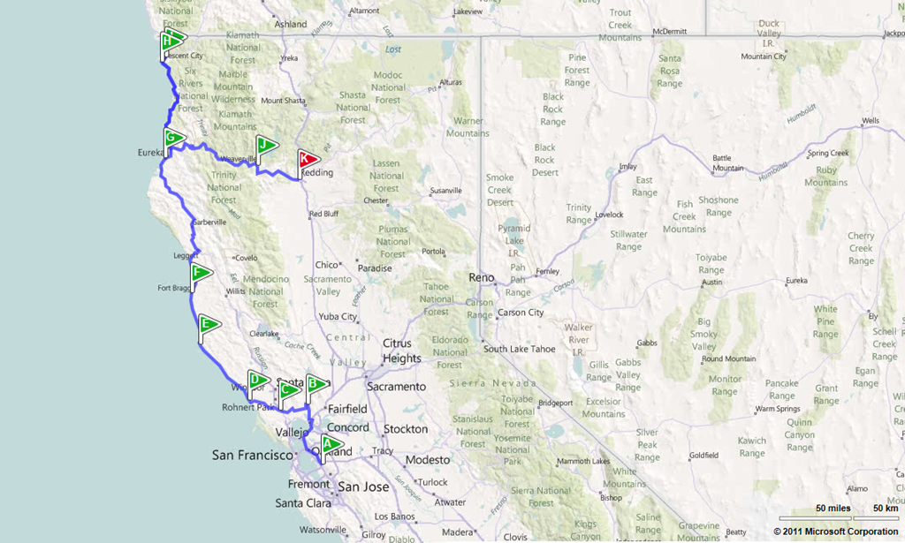

Eigenlijk is het een beetje een raar park. Je hoeft geen entreegeld te betalen, en in feite is het een aantal State Parks en een relatief klein National Park wat samengevoegd zijn onder de noemer Redwood National Park. We zijn hier 4 nachten gebleven op drie verschillende campings.

We zijn in het weekend van vaderdag aangekomen, en dat is blijkbaar big business hier in Amerika. Overal zie en hoor je reclames over "special father's day specials". Gelukkig hadden ze op de eerste camping nog 1 laatste plekje voor ons :-) Van hieruit hebben we een wandeling gemaakt naar de kust, in totaal 12 mijl (ja, dat was een beetje te ver).

Eergisteren ben ik even creatief geweest met de nieuwe camera van Chantal en een panoramafoto gemaakt van een stelletje redwoods. Zie hieronder het resultaat...

Gisteren hebben we de kust verlaten, en zijn nu aangekomen in Redding, California. Van hieruit gaan we Whiskeytown Recreational Area en Shasta Lake verkennen.

We moeten nog op zoek naar een alternatief voor ons geplande bezoek aan Lassen Volcanic Park, daar ligt nog sneeuw! Volgens de officiële website op 17 juni nog op sommige plekken 20 tot 30 feet (7 tot 10 meter).
