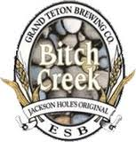

Ik moet even terug komen op mijn vorige post waarin in beweerde dat Amerikanen geen bier kunnen maken. Begin deze week was ik in een liquor store en die waren ruim voorzien van verschillende soorten bier. De flesjes met de naam Bitch Creek trokken mijn aandacht, niet zozeer door het (lelijke) etiket of de naam, maar wel door de naam van de brouwerij...

We hebben in 2008 een aantal dagen doorgebracht in Grand Teton National Park, voordat we naar Yellowstone gingen. Het bier wat ze daar brouwen is LEKKER! Jammer dat ik dat toen niet wist.

## 1 opmerking

### Anoniem 23 juni 2011 om 19:50

Hallo,

Je moet natuurlijk wel oppassen in een volle kroeg als je dit biertje bestelt bij de barjuffrouw. Stel je voor dat ze je niet goed verstaat.....

Groetjes uit W&A
