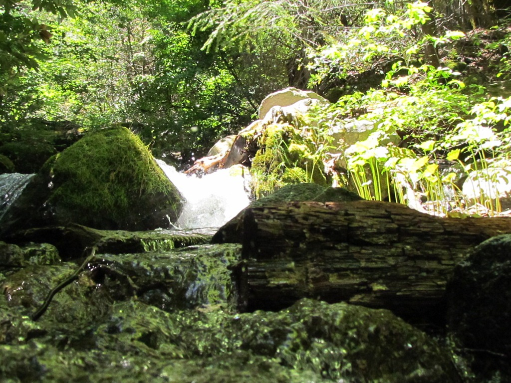
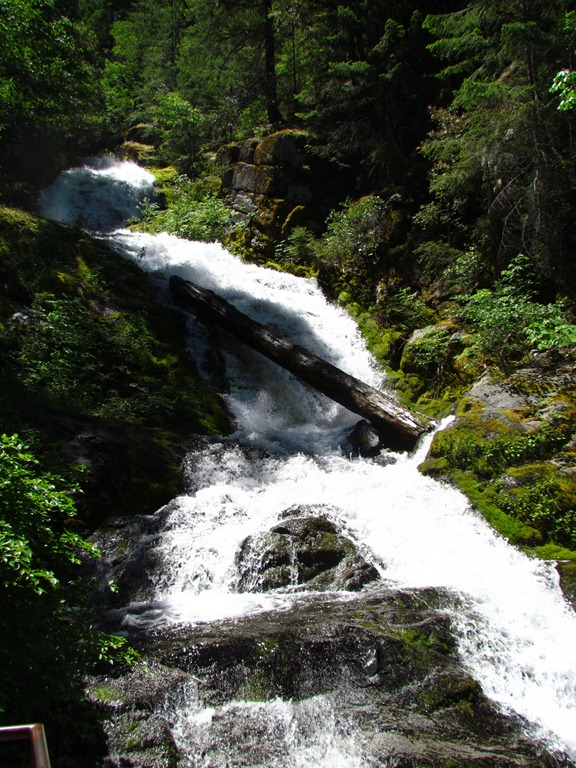

We zijn nog steeds in Redding, een toegangsstadje tot Whiskeytown Recreation Area. Ze hebben hier een stuwmeer en daarin zijn we gisteren gaan zwemmen. Het is namelijk meer dan 38 graden en behoorlijk vochtig.

Vandaag hebben we een wandeling gemaakt naar de Whiskeytown Falls. Het was wederom erg heet, en de wandeling van 4 km ging alleen maar bergop. Maar de watervallen waren erg mooi.

Na de wandeling zijn we naar de haven gereden en daar hebben we een motorbootje gehuurd. Ik heb me 2 uur lang kostelijk vermaakt, en Chantal is meerdere keren het water ingesprongen.

Zie hieronder (NSFW) het bewijsmateriaal van een zeer blije Roger...



## 1 opmerking

### Gerard 25 juni 2011 om 11:47

Hallo Vakantiegangers,
Gelukkig Roger dat je toch een overheerlijk biertje heb mogen aantreffen. Wat zou een vakantie zijn zonder..... Dat jij je, met je bootje, kostelijk hebt vermaakt is je in het filmpje aan te zien. Big American been boating!!! Chantal zocht verkoeling in het water. Een zweefduik vanaf een varende boot zal wel spectaculair zijn geweest.
G&G
Mams en Paps
