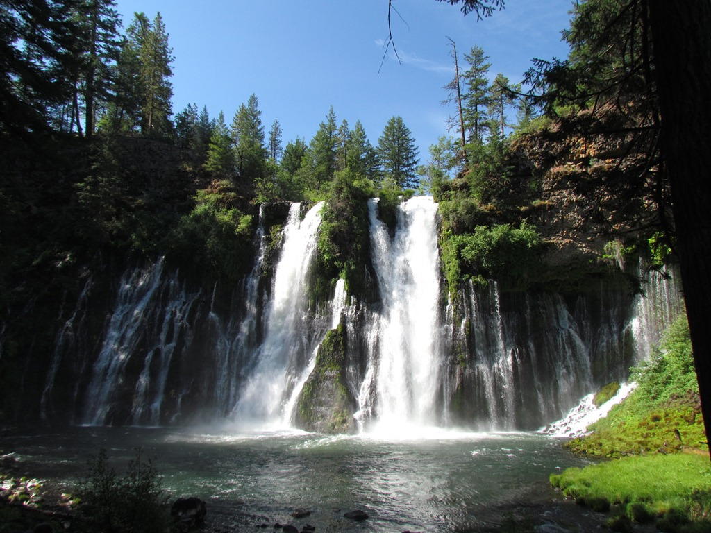
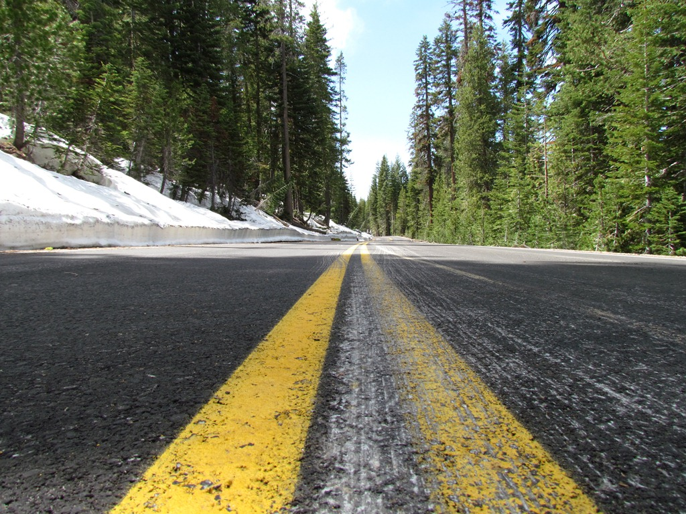
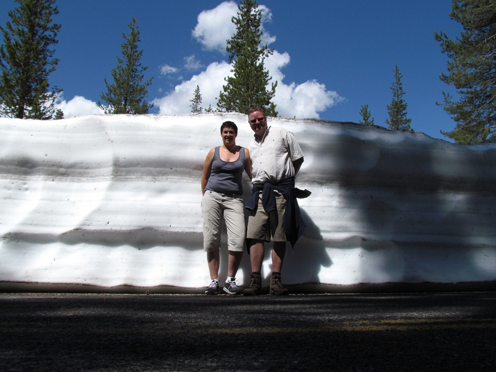
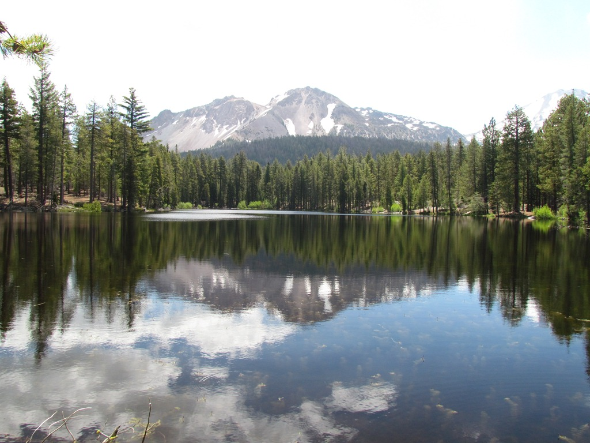
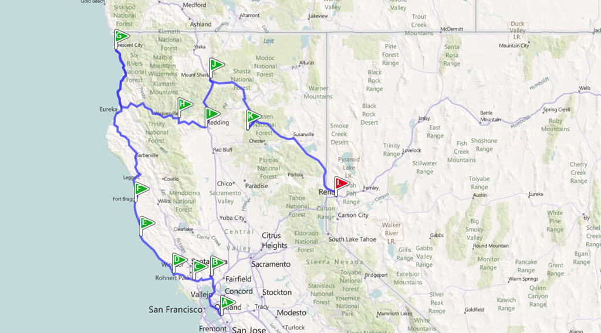

Vanuit Redding zijn we via Mount Shasta naar Burney Falls gereden. In het bijbehorende State Park hebben we overnacht en de volgende ochtend hebben een wandelingetje gemaakt rond de waterval. We vonden het allemaal boven verwachting mooi, ondanks dat de camping ~~niet zo bijzonder~~ smerig was.

Na de wandeling zijn we naar Lassen Volcanic National Park gereden.

Ondanks dat een groot deel van het park nog niet open was vanwege sneeuw, was het toch zeer de moeite waard.

De doorgaande weg door het park was nog niet helemaal sneeuw-vrij gemaakt, wat op 24 juni toch wel een bijzonder gezicht is. Zoals je ziet, ligt er nog behoorlijk wat sneeuw! Op sommige plekken tot 5 meter!

Vlakbij de camping in het park hebben we in de ochtend toch nog een aantal leuke wandelingen kunnen maken.

's Middags zijn we doorgereden naar Reno in de staat Nevada. Reno is een Vegas-kloon(tje), dus we hebben net een casino bezocht om te eten. Een en ander was van een nog hoger kitschgehalte dan in Vegas, en bovendien moest Chantal d'r ID laten zien toen ze een drankje bestelde (?!?!). Nou ja, we zien het maar als compliment dat ze nog als teenager wordt aangezien :-)

Morgen gaan we richting Lake Tahoe, wat op de grens tussen Californie en Nevada ligt, en al grotendeels in de richting is van Yosemite. We willen donderdagochtend al in Yosemite aankomen, om de drukte van het 4th of July weekend voor te zijn. Hopelijk vinden we nog een plekje in het park zelf... anders zal het moeilijk worden vrees ik. Het is een lang weekend voor de Amerikanen, dus er wordt grote drukte verwacht.

## 2 opmerkingen

### Sergio 27 juni 2011 om 21:17

Niet vergeten!!!

The Ansel Adams Gallery
Village Mall
Yosemite National Park, CA 95389

The Ansel Adams Gallery is open seven days per week, from 9AM to 5PM, Pacific Time, with extended hours in the summer.

We are located in the heart of Yosemite Valley, between the Visitor Center and Post Office, with incredible views of Yosemite Falls, Half Dome, and Glacier Point.

groetjes!

### Gerard 30 juni 2011 om 23:47

Hallo Chantal en Roger.
Het zijn toch allemaal plaatjes die zo op een mooie kalender over de VS zouden passen en volgens mij genieten jullie met volle teugen.
Groetjes

Mams en paps
