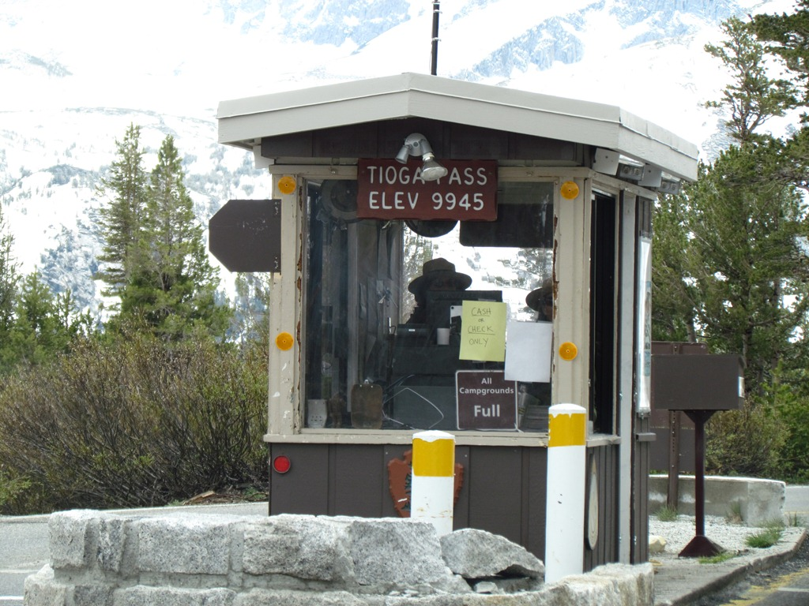
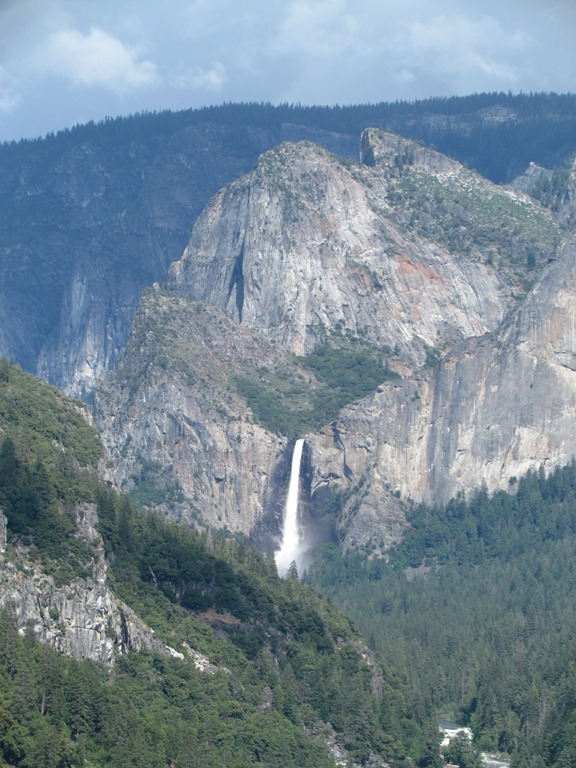

Vanuit Lake Tahoe zijn we naar het zuiden gereden en hebben overnacht in Grover Hot Springs State Park. En natuurlijk hebben we een duik genomen in de hot springs. Het water was zo’n 40 graden en we hadden een mooi uitzicht op de omringende bergen. 's Avonds begon het te regenen, gelukkig toen we net klaar waren met de BBQ. Het heeft de hele nacht behoorlijk hard geregend en ook de volgende dag af en toe. We hebben dus de Tioga Pass naar Yosemite in de regen moeten rijden. Er ligt nog ongelooflijk veel sneeuw op de pass die 10000 feet hoog is, dus dat is niet zo heel bijzonder. Het schijnt dat twee dagen geleden het nog gesneeuwd heeft en dat ze de pas gesloten hebben!

Maar zoals gezegd, we zijn inmiddels weer in Yosemite. We blijven hier tot en met dinsdag, dan gebruiken we de woensdag om naar San Francisco te rijden om daar ergens in de buurt van de camperverhuurder te gaan overnachten. Volgende week donderdag moeten we het ding in de ochtend weer inleveren.

## 1 opmerking

### Gerard 2 juli 2011 om 11:28

Dag vakantiegangers,

Het is en blijft mooi om jullie op de rondreis te vergezellen en hier en daar even mee te kijken met wat jullie allemaal zien en tegenkomen.
De uitdrukking "ik zie beren op mijn weg" is bij jullie wel heel erg letterlijk. En Roger goed dat je Chantal naar binnen hebt gestuurd. Als de beren zo dichtbij komen is dat toch het veiligst.
Het schiet al weer op dus geniet nog maar even van Yosemite

Groetjes
Mams en Paps
