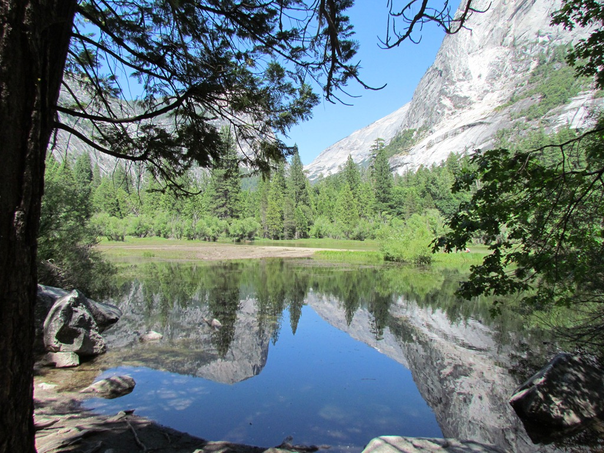
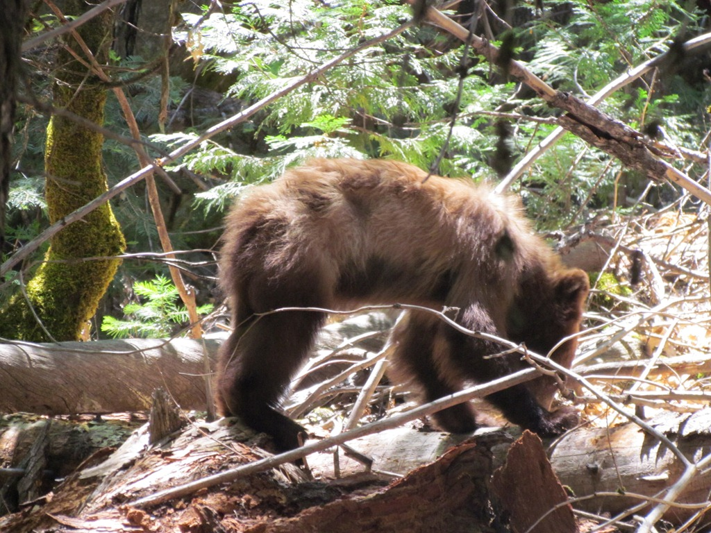
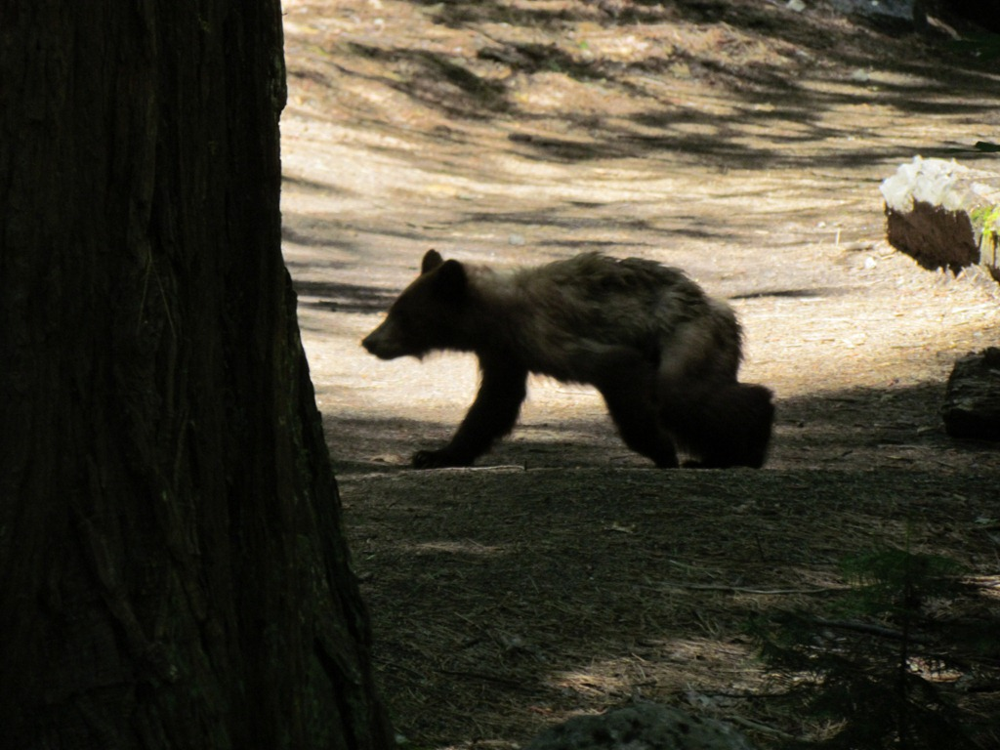

Onze eerste dag in Yosemite hebben we een beetje rustig aan gedaan. We zijn al vroeg naar het park gereden en toen de shuttlebus genomen naar Mirror Lake. Het eerste deel van de wandeling is zeer makkelijk over een asfaltweg. Alle Amerikanen nemen een koelbox mee en gaan met de hele familie lunchen bij het meer. Op zich heel mooi natuurlijk zoals je hieronder kunt zien.

Maar de Batentjes zijn natuurlijk iets verder gegaan. Om het meer loopt namelijk een pad, en daar loop je dan in je eentje. Nou ja, in je eentje...

We waren in eerste instantie wat angstig. Niet zozeer voor dit jong, maar meestal worden ze vergezeld door de mamabeer en die zijn nogal beschermend ingesteld. Deze bleek echter geen mama meer te hebben. We konden 'm tot een meter of 10 benaderen en toen vluchtte hij het bos in.

