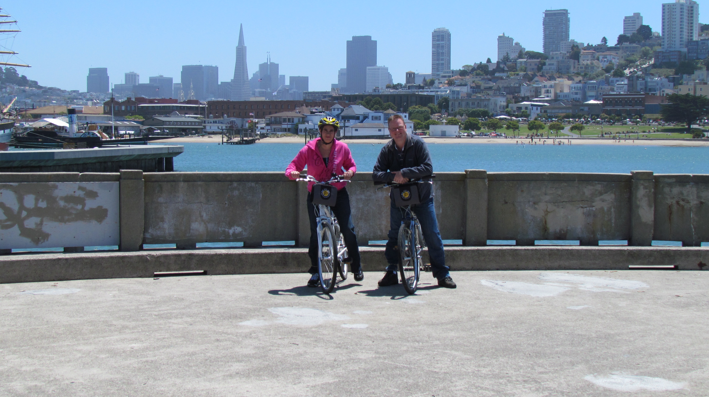
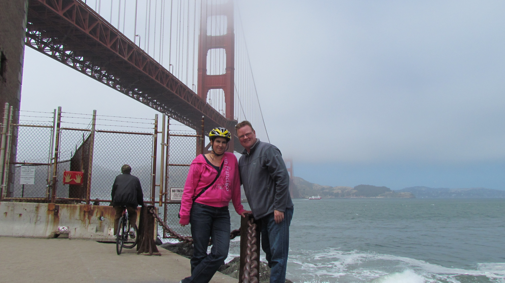

En we zijn weer thuis in San Francisco. Vandaag hebben we fietsen gehuurd en zijn de Golden Gate brug over gefietst naar de andere kant van de baai naar Sausalito. Hier hebben we de ferry terug maar SF genomen.

Bij terugkomst was het etenstijd dus zijn we op zoek gegaan naar het Italiaanse restaurant waar we twee jaar geleden ook geweest waren. En gelukkig hebben we het gevonden: Franchino op de hoek van Columbus en Grant. Als je ooit in de buurt bent, hier MOET je eten. In een woord geweldig! Het is een familierestaurant, en heel klein. Papa staat aan de deur, mama kookt en de dochter bedient. Papa herkende Chantal nog van de vorige keer... De Italiaanse slijmbal (pleonasme?)...

## 1 opmerking

### Anoniem9 juli 2011 om 10:50

Toffe fietstocht. Het is altijd hetzelfde met die Papa di Tutti's. Zijn jullie niet heel erg vroeg met het plaatsen van jullie 9/7 blog?
