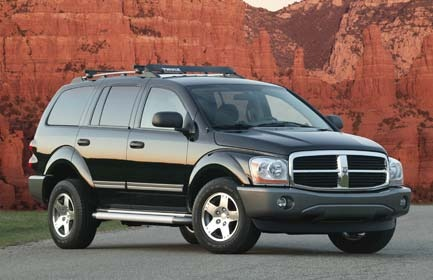
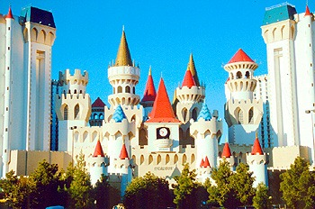
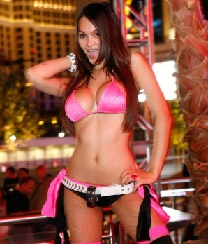

Gisteren zijn we uiteindelijk met anderhalf uur vertraging om 10 uur 's avonds aangekomen in ons hotel Excalibur in Las Vegas.

Maar eerst hebben we de huurauto opgehaald: het is een Dodge Durango geworden. Een joekel van een bak en een maand of 2 oud. Ik heb natuurlijk nog maar een klein stukje gereden van het vliegveld naar het hotel, maar vooralsnog ben ik helemaal happy.

En dan het hotel: combineer alle kitsch die je kunt bedenken in 1 hotel, en dan nog heb je niet Excalibur bij elkaar verzonnen. Tsjonge, wat maken ze er toch altijd een Disney-gedoe van!

Het hotel heeft een middeleeuws kasteel als thema. Dus overal zie je ridders, kantelen en jonkvrouwen (?) in miniscule bikini’s, die je proberen te verleiden om nog maar een extra dollar in de automaten te gooien. Goh, wat zullen hun vaders trots op ze zijn.

Eigenlijk is het allemaal wel wat triest: Amerikanen sparen een jaar lang om dan een lang weekend uit hun dak te gaan. En dat doen ze heel Amerikaans: de dames in hun allerstrakste en minst verhullende jurk (ongeacht of ze het kunnen hebben of niet), de heren in korte broek, t-shirt en petje en flesje Heineken in de hand, maar vooral ook LUID.

## 2 opmerkingen

### Anoniem 22 oktober 2011 om 20:43

Ja maar ja maar ja maar, waarom wil je nog naar de dufdays als je die meid hebt gezien?
Grt,
Ronald

### Anoniem 26 oktober 2011 om 18:54

Prachtig, Las Vegas! Ik denk dat die moeders ook heel trots zijn om zo'n lekkere dochter af te leveren!
Groeten, Ben
