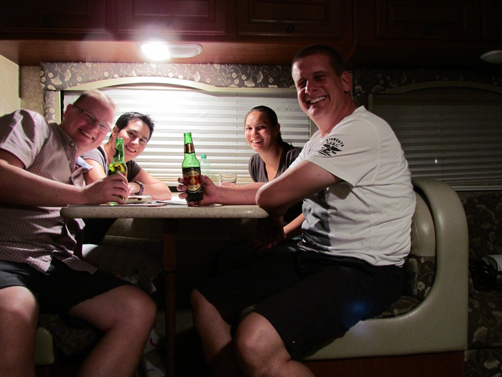
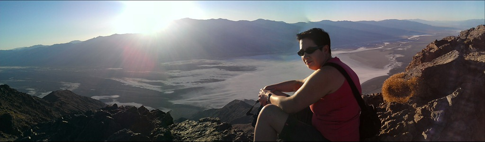
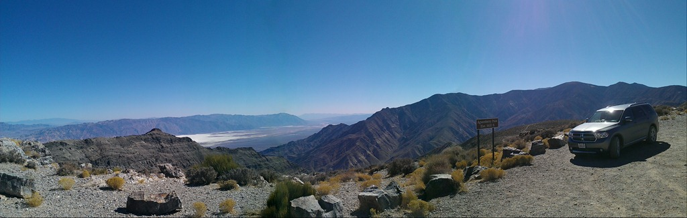

Hallo daar,

Zaterdag zijn we van Las Vegas naar Death Valley gereden. Een ritje van zo'n 3 uur. Vlak voordat we het park inreden kwamen we door een gehucht van drie huizen en een GSM mast, dus hadden we heel even bereik met de mobiele telefoons. Even met onze grote vriend Barry gebeld, want zij zijn vorige week vanuit San Francisco met een camper vertrokken en komen onze kant op. Wat zou het leuk zijn als we elkaar dan zouden kunnen treffen aan de andere kant van de wereld! En wat een toeval: wij bereik en zij ook! Dus hebben we zondagavond afgesproken om naar hun camper te komen kijken. Aangezien Barry jarig was, hadden we nog vlug een taartje (met kaarsjes!) gekocht. Daarna zijn we nog wat gaan eten en hebben een biertje gedronken. Het was heel bijzonder om elkaar op zo’n grote afstand van huis te ontmoeten.

Maar 's middags zijn we eerst gaan offroaden. Niet echt super uitdagend allemaal, maar toch wel spannend om in zo’n verlaten landschap te rijden. Je komt bijna niemand tegen.

## 1 opmerking

### Gerard25 oktober 2011 om 01:02

Hallo Vakantiegangers.

Zo te zien gaat alles nu, na een wat vertraagde start, weer op rolletjes.
You have a fat cool car man.........
Las Vegas lijkt ondanks de crisis nog steeds een welvarende stad.
Leuk trouwens dat jullie de verjaardag van Barry, zo ver van huis, nog wat luister hebben kunnen bijzetten.

Groetjes en have fun
Mams en Paps
