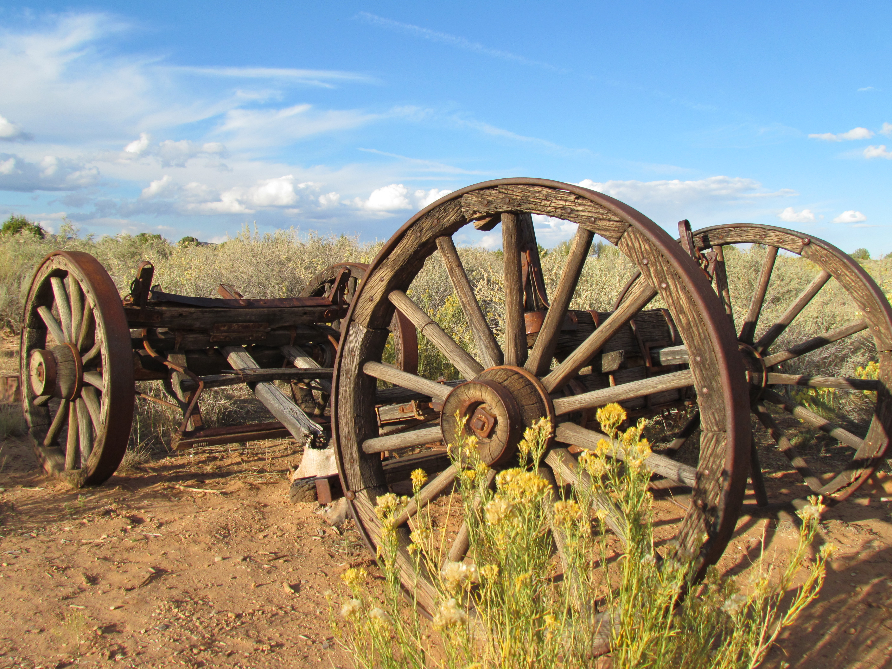

Maandag hebben we door Titus Canyon gereden. Om hier te komen moet je een offroad weg nemen (nog steeds in Death Valley trouwens) van ongeveer 45 kilometer. Het grootse deel was makkelijk begaanbaar, maar halverwege kwamen we toch op een spannend stuk.



De canyon zelf bereik je na een dik uur rijden, en is niet breder dan 4 meter. Zeer spectaculair was het al met al, maar we hebben het overleefd!

Na dit avontuur zijn we via een heel mooie weg naar onze overnachtingsplek gereden. En die was behoorlijk apart: een tipi (of wigwam). We kwamen in het donker aan, wat niet heel erg cool was, want het ding staat echt in de middle of nowhere. De tipi was veel groter dan wij gedacht hadden. Een kingsize bed en ook nog twee eenpersoonsbedden en een firepit waarin allemaal waxinelichtjes stonden. We hebben na alle belevenissen erg goed geslapen, tenminste, totdat een stuk of 20 coyotes bedachten dat het tijd was voor een ochtendconcert. Wat een gejank en gepiep was dat zeg! Maar de eigenares had ons er al voor gewaarschuwd.

We zijn zojuist gearriveerd in Page, Arizona en om hier te komen hebben we vier staten doorkruist: begonnen in Californie, toen Nevada, Arizona, Utah, en toen weer Arizona. Onderweg hebben we in Utah nog een national monument bezocht over de eerste Mormonen die hier kwamen. Was leuk en we hebben wat leuke foto's kunnen maken.

## 3 opmerkingen

### Anoniem26 oktober 2011 om 15:37

Ugh, chique zo'n tipi, is weer eens wat anders.
Spectaculaire tochten over die bergpaden, lijkt me geweldig spannend, zou ik ook wel willen.
Prachtige auto overigens, zal wel ontspannen rijden, tenminste als je op de normale wegen blijft.

De groeten uit het Heerlense en nog veel plezier.

### Gerard27 oktober 2011 om 10:55

Toch weer een mooi stukje USA met enerverende autoritten. Erg leuk lijkt me.
De tipi is toch wel erg groot. Heb je ook foto's van binnen gemaakt. Ben erg benieuwd.
Veel plezier verder.

Groetjes
H&G

### Adi Derksen31 oktober 2011 om 08:29

Wat leuk zeg en avontuurlijk!
