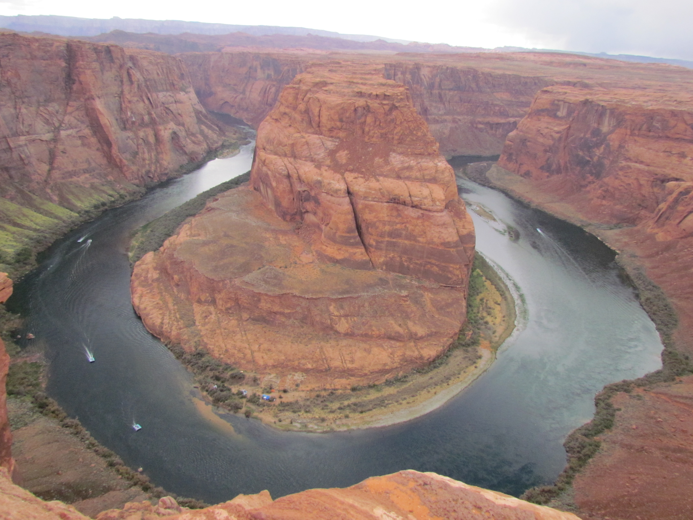
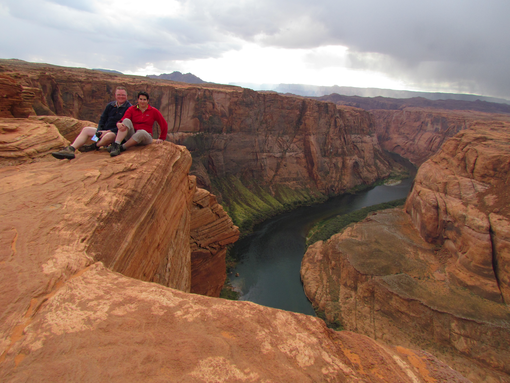
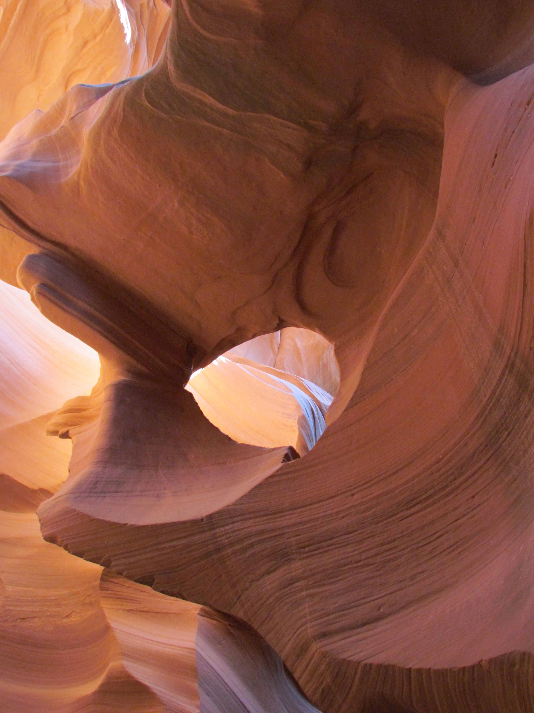
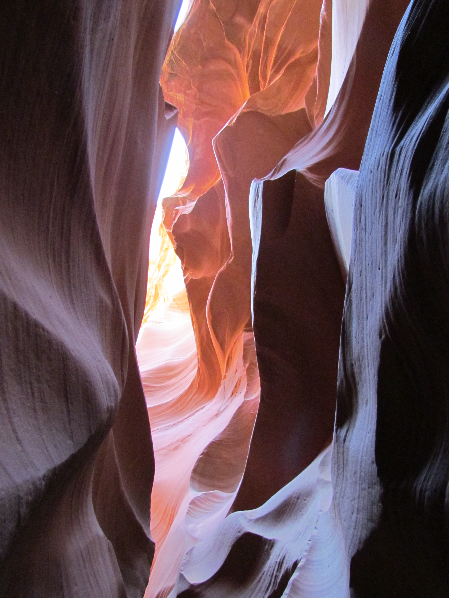

Eergisteren zijn we aangekomen in Page, Arizona. En het is er koud, zo'n 10 graden. Woensdagochtend regende het heel hard, maar later klaarde het gelukkig wat op. We hebben geprobeerd de Cottonwood Road (een onverharde weg die richting Bryce Canyon gaat) te rijden, maar zijn na 10 kilometer omgedraaid. Het was een modderballet en de auto gleed alle kanten op. We voelden ons er niet comfortabel bij, dus zijn we maar teruggekeerd. Terug in Page zijn we naar Horseshoe Bend gaan kijken. Hier maakt de Colorado River een mooie bocht die je vanaf een rots op 300 meter hoogte kunt bekijken.

Vanmorgen zijn we eerst in Page naar de Antelope Canyon geweest. Twee jaar geleden hebben we de Upper Canyon bezocht, maar vandaag zijn we naar de Lower Canyon geweest (bedankt Nick!). De Canyon is een zogenaamde Slot Canyon, wat betekent dat de bovenkant van de "grot" open is, zodat het zonlicht erin kan schijnen. En dat levert mooie plaatjes op!

Na het bezoek aan de Canyon hebben we de Cottonwood Road nogmaals geprobeerd en de weg was nu mooi opgedroogd. Wat een mooie rit zeg! We zijn onderweg letterlijk drie andere auto's tegengekomen, wat toch bijzonder is als je bedenkt dat de weg 65 kilometer lang is.

Aan het einde van de weg kom je uit in Utah in Kodachrome Basin State Park, een onverwacht pareltje! Helaas waren we wat aan de late kant, want hier zijn mooie wandelingen te maken, waar we nu dus geen tijd voor hebben gehad. Bij dezen dus toegevoegd aan de lijst voor een volgend bezoek aan deze regio!

En nu zijn we aangekomen in Bryce Canyon waar we twee nachten gaan blijven. Het heeft hier gisteren gesneeuwd! Ben benieuwd of er in het park zelf nog iets van te zien is.

## 2 opmerkingen

### Anoniem 28 oktober 2011 om 06:36

Hallo mede USA gangers. Mooie ritten en wandelingen gemaakt zien we. Wij zijn inmiddels nabij Petrified Forest. Zijn vandaag vertrokken uit Grand Canyon en hebben ook nog Wupatki NM en Walnut Canyon NM bezocht. By-the-way: Red Rock is wel ok, voor paar leuke wandelingen. See ya in Oeteldonk.

### Anoniem 28 oktober 2011 om 17:11

Hallo jongelui,prachtige foto's van de grotten.

In enkele dagen zien jullie wel veel verschillende hoogtepunten, zoals "Horseshoe".
Die lijkt wel wat op de Saarschleife in Metlach die wij onlangs bezocht hebben.

Fijne dagen nog en de groeten van pa en ma Baten.
