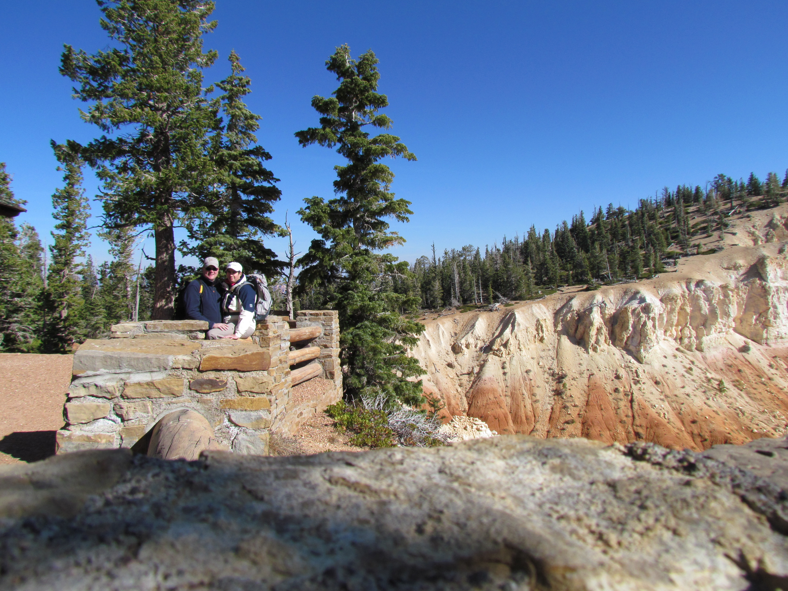
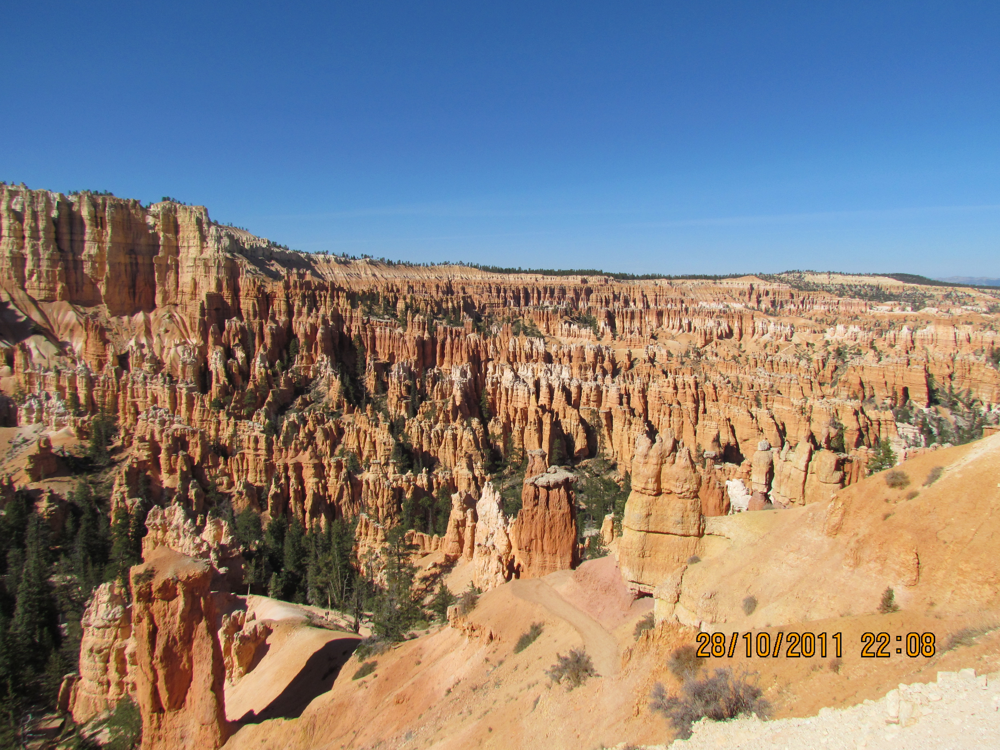

Gisteren hebben we een zeer mooie wandeling gemaakt in Bryce Canyon. Chantal had twee fleecevesten en de zomerjas over elkaar aangetrokken. Het is dan ook steenkoud, maar gelukkig wel zonnig en een strak blauwe hemel. Op dit moment (9 uur in de ochtend) is het nog steeds -10 graden...

De wandeling was behoorlijk inspannend, stijgen, dalen, nog meer stijgen. En het vervelende van wandelen in een canyon is, dat je op het einde altijd weer uit de canyon moet klimmen.

Nee, al met al was het geen lullige wandeling.

We vertrekken zo voor de laatste twee dagen naar Zion National Park, daar schijnt het vandaag en morgen weer 20 graden te worden.

Tot later!

## 2 opmerkingen

### Gerard30 oktober 2011 om 11:45

Het blijven bijzondere plaatjes die grotten.
Ondanks koud koud koud.... is de Brrrrryce Canyon toch wel erg mooi. Het weer is jullie daar goed gezind want het zonnetje schijnt. Veel plezier nog in Zion National Park.

Groetjes
Mams en paps

### Anoniem30 oktober 2011 om 15:44

Idd da's koud! Maar ik zie dat jullie boerenbruin kunnen gaan halen. Have fun. Blijkbaar is het oostelijker wat warmer. We proberen het toch ook vandaag weer met korte outfit. H&B
