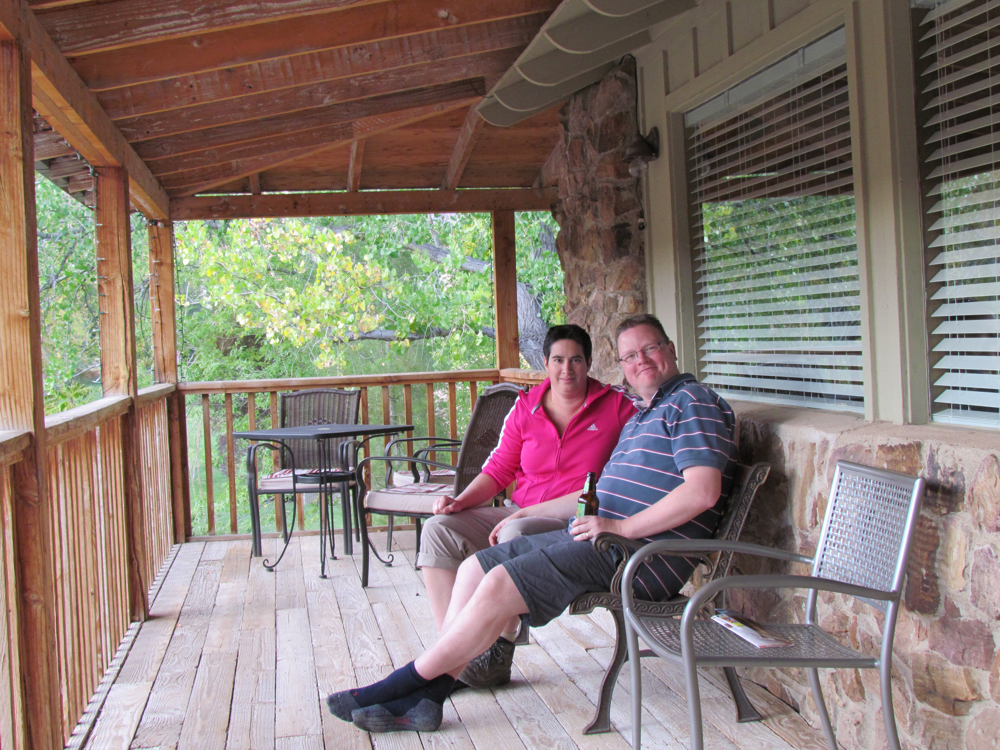
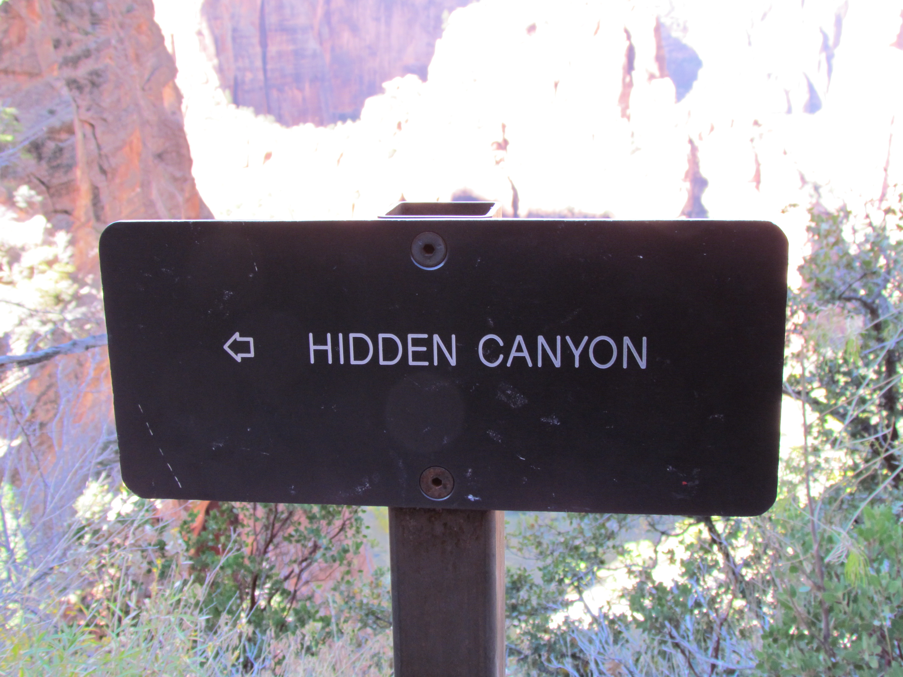
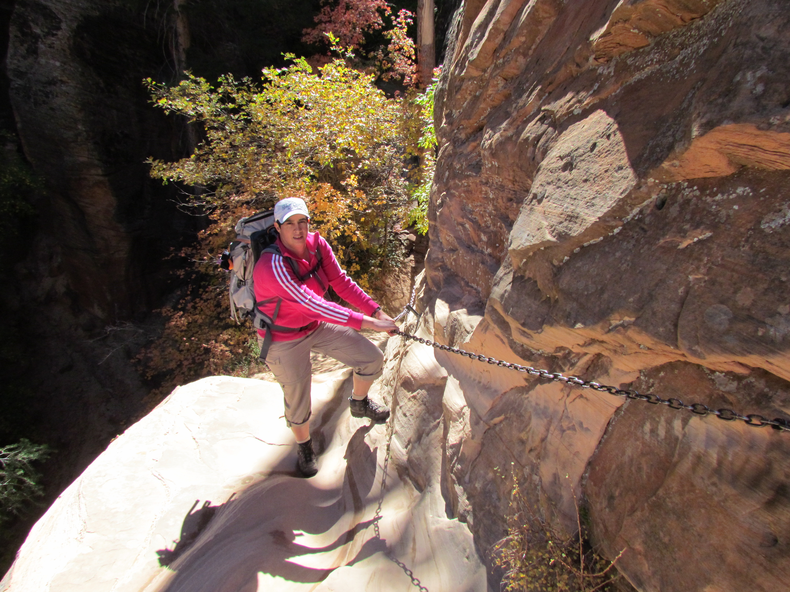
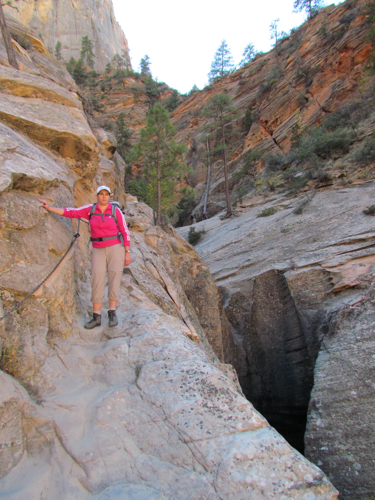

Zo, lief dagboek, in Zion is het aangenaam van temperatuur, verblijf en voedsel! We hebben een leuk bed and breakfast gevonden op 5 minuten rijden van het park. Ik tik dit berichtje op onze eigen porch (zonder schommelstoel helaas, maar met bier) en kijk uit op het waanzinnige landschap.

Er viel ons hier een tweetal zaken op:

Ten eerste: Het feit dat een restaurant Spotted Dog (gevlekte hond) heet, betekent niet dat je hondenvoer krijgt! In tegendeel, het lokale bier en de homemade meatloaf, mashed potatoes en gravy smaakte bijzonder goed (kan het ook anders wanneer het gemaakt wordt van gemalen hert, buffalo en rund?). Nu ik het zo lees klinkt het eigenlijk helemaal niet zo goed :-)

Ten tweede: een zogenaamde "hidden canyon" is eenvoudig te vinden, want hij staat gewoon op de kaart en is voorzien van meerdere bordjes.

Het vinden van de canyon op zich was niet zo'n probleem, er geraken wel degelijk! Een steil pad, daarna met handen en voeten klauteren en je aan kettingen omhoog trekken!

Een klein foutje en je belandt een paar honderd meter lager met je kadaver, dus uitkijken geblazen!

## 1 opmerking

### Sergio 31 oktober 2011 om 13:57

Hebben jullie de hand van "127 hours" gevonden?
veel plezier nog!!!!!
