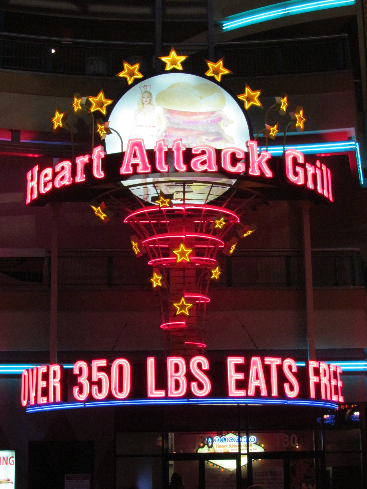

Ja lieve mensen, het zit er weer op helaas. De afgelopen drie dagen heb ik de conferentie DevConnections bijgewoond, en dat was eigenlijk best wel behoorlijk plezierig. Goede sessies gehad, veel nieuwe dingen geleerd en ook een paar goede gesprekken gehad met wat Amerikanen (en een verdwaalde Australier). Mijn gesprek van vandaag met een onvervalste Texaan spande wel de kroon: hij was er groot voorstander van dat iedereen een gun moest hebben, want je moet jezelf kunnen verdedigen tegen anderen. Mijn opmerking dat als niemand een gun heeft er ook weinig te verdedigen valt, lachtte hij weg. "Wanneer alleen de overheid wapens mag hebben, dan wordt je land vanzelf een dictatuur". Toen ben ik maar een desert gaan halen... Wat een kul.

Vanavond ben ik met Chantal naar Fremont Street geweest, zeg maar het oude downtown voordat de Strip bestond. Ze moeten er daar van alles aan doen om toeristen, of eigenlijk hun geld, te lokken, want het is een behoorlijk eind van de Strip verwijderd. Vanuit ons hotel duurde het ritje over de Strip bijna 3 kwartier vanwege de grote drukte. Maar dan kom je ook wel ergens terecht zeg, vergane glorie dekt niet helemaal de lading. De hoofdstraat is overdekt door het grootste beeldscherm ter wereld en ieder uur wordt er een lichtshow ten beste gegeven. Spectaculair!



Maar wat ik helemaal geweldig vond was onderstaand restaurant. Dit kan echt alleen maar in Vegas. Stel je voor: serveersters verkleed als (zeer) sexy zusters, klanten in een ziekenhuispyjama, je weet wel zo'n schort uit de film, en een JOEKEL van een hamburger! Haha, ik mocht niet naar binnen van Chantal, zogenaamd vanwege de hamburger ;-)

Ik mocht geen foto maken van de zusters helaas...

Morgenvroeg om 9 uur vertrekken we weer richting Nederland.

## 1 opmerking

2-op-reis5 november 2011 om 14:11

Mooi verhaal van die Texaan. Typisch (duits uitgesproken)! Goede thuiskomst. Wij gaan vandaag kijken of de King's geest nog rond dwaald.
