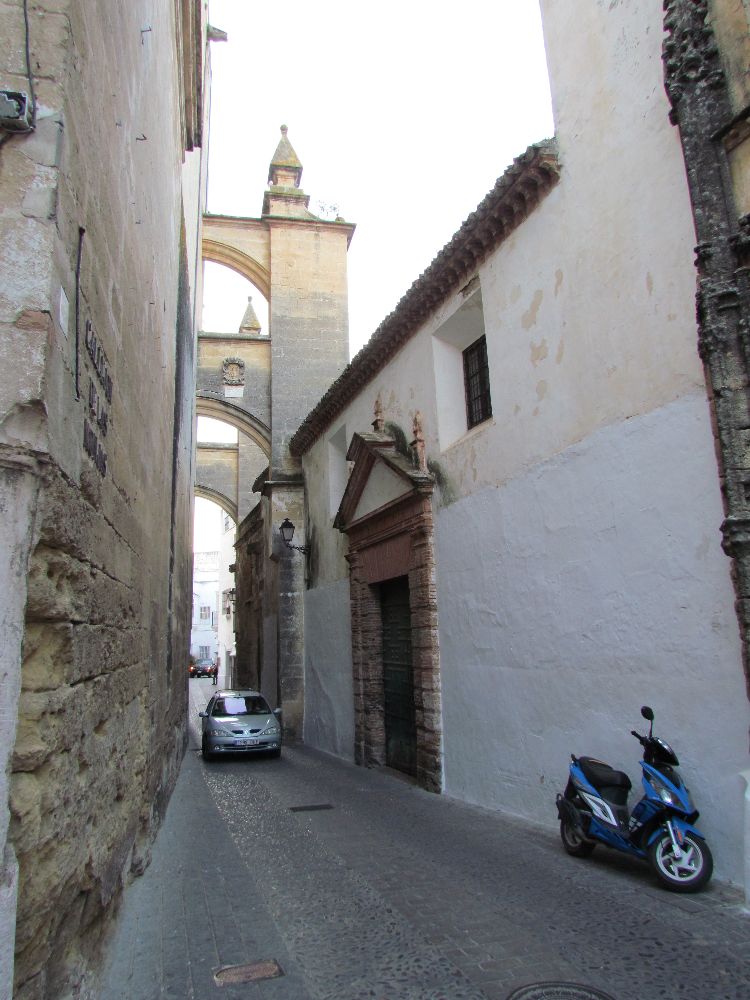
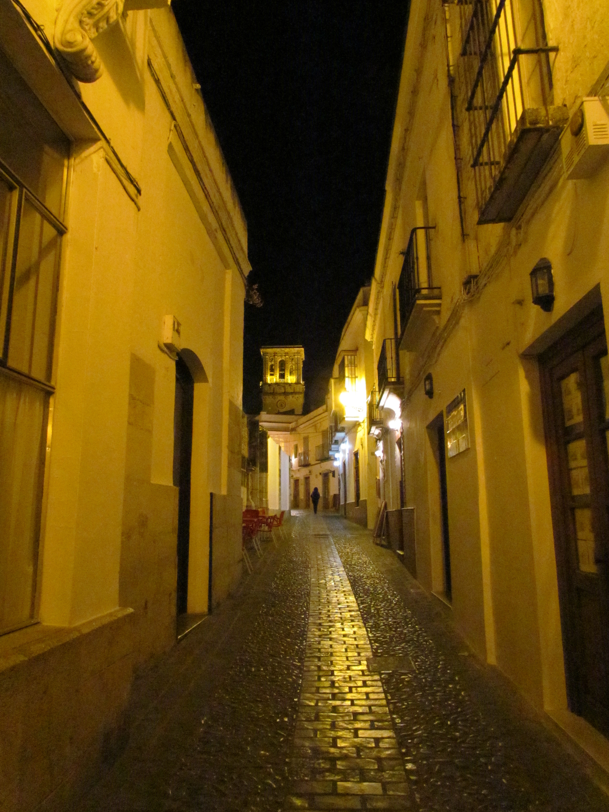
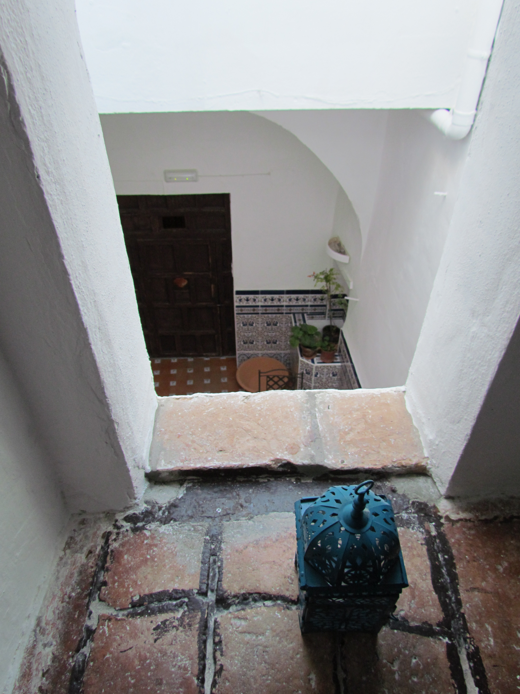
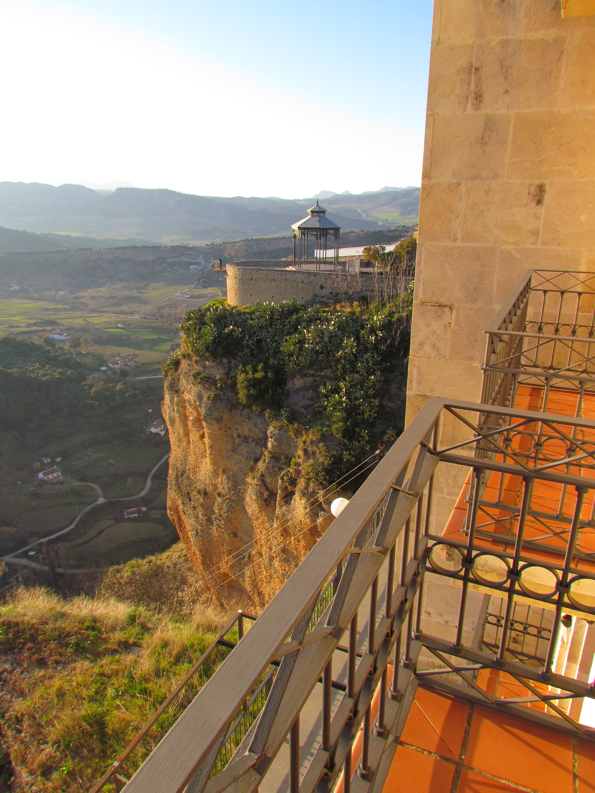

Om 3 uur in de ochtend opstaan is niet fijn, behalve natuurlijk als je van een weekje vakantie gaat genieten! Gelukkig was er deze keer geen bommelding, dus klokslag 6.30 hingen we in de lucht boven het pittoreske Weeze: op weg naar Sevilla! De vlucht was niet heel erg onprettig, op een druk kind achter ons na.

De auto ophalen ging heel erg Spaans: de chauffeur was maar een half uur te laat, daarna moesten we een kwartier wachten bij de receptie op het verhuurstation. Uiteindelijk kregen we onze gereserveerde auto, maar toen bleek dat het ding een lekke band had, kregen we uiteindelijk een Megane station mee.

Via een heel mooie weg dwars door Parque Natural de Sierra de Grazalema zijn we aangekomen in Arcos de la Frontera, bij onze B&B La casa sueño. Het blijkt dat de eigenaren een paar jaar terug hebben meegedaan (en gewonnen) aan het Net5 programma "De Spaanse Droom". Ondanks dat en het feit dat je twintig minuten moet lopen met al je bagage, bleek het een pareltje te zijn in een zeer leuk dorpje met smalle, nee, heel smalle straatjes! Ik heb niet een auto gezien zonder deuken en krassen...

Vandaag hebben we in het natuurpark gewandeld, de Salto del Cabrero, zo'n 11 kilometer in totaal, naar een of andere afgrond. Was wel de moeite waard.

Nu zijn we in Ronda, volgens de Lonely Planet het mooiste "witte dorpje", en dat is knap, want alle dorpjes hier zijn wit! Zal wel door de ligging op een rotspunt komen. En laat daar nou precies ons hotel liggen!

Wat je noemt "a room with a view"...

## 1 opmerking

### Anoniem 13 februari 2012 om 10:09

Is heel mooi, moeten wij toch maar 'ns met de caravan naar toe. Hebben jullie ook nog lekker weer? En zijn er ook tapa's zoals in Sevilla?
Wij wensen jullie nog veel plezier en tot ziens.
Groeten uit Heerlen
