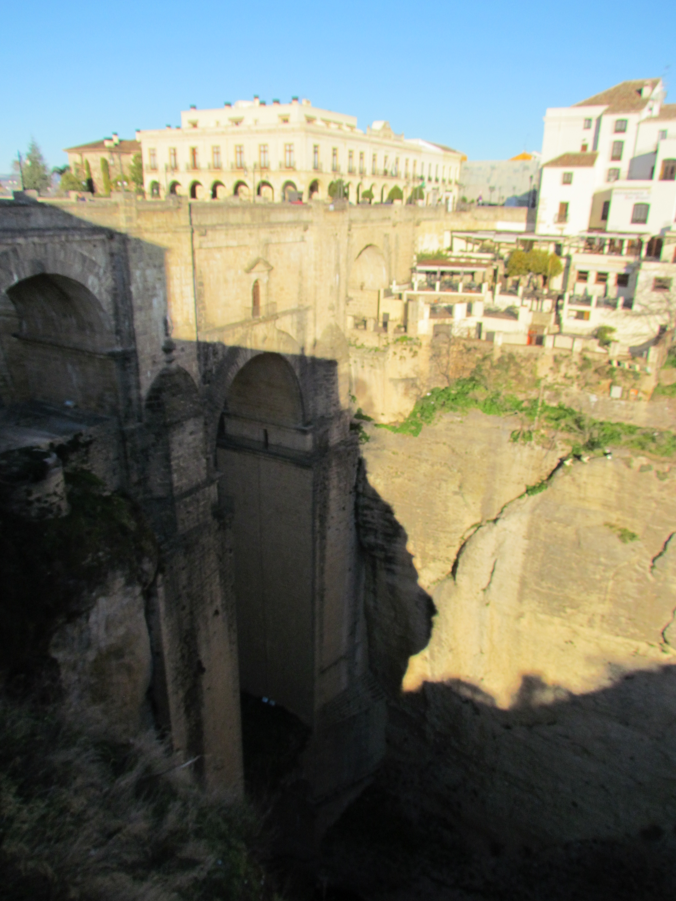
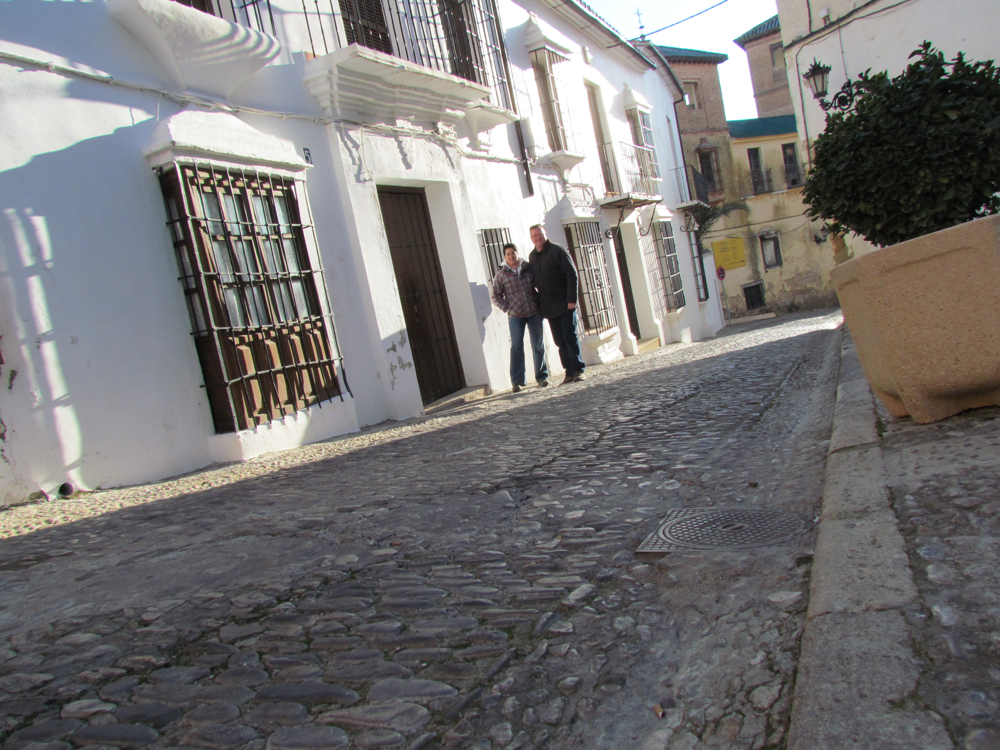

Vanmorgen waren we lui en zijn op ons gemak opgestaan. Na het ontbijt hebben we een klein rondje Ronda gedaan, en het is inderdaad een erg leuk dorpje.

Het gebouw links aan de overkant van de brug is ons hotel.

Daarna zijn we weer terug gereden naar Sierra de Grazalema om de wandeling La Gargante Verde te doen. In deze vallei leeft de grootste populatie van een of andere gier. Machtig om die beesten te zien zweven door de lucht.

De afdaling naar de bodem van de kloof was zwaar met treden die soms meer dan 50 cm hoog waren, en we hebben dus goed kunnen oefenen op het berggeit-zijn.

Daarna zijn we naar Malaga gereden waar we lekker in de hot-tub hebben gezeten.
