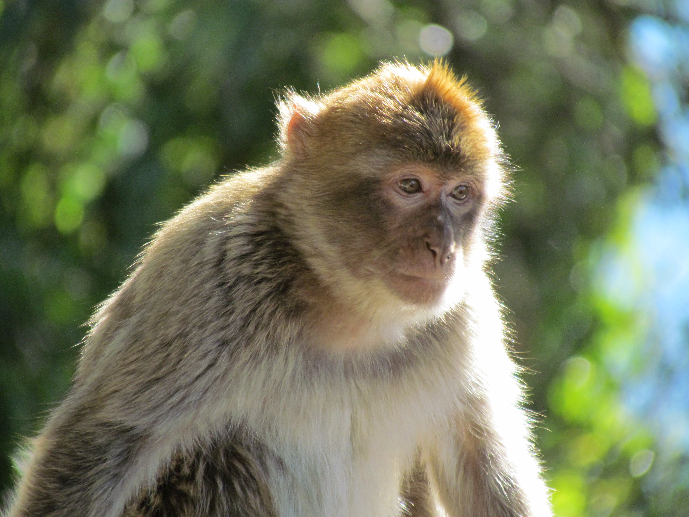
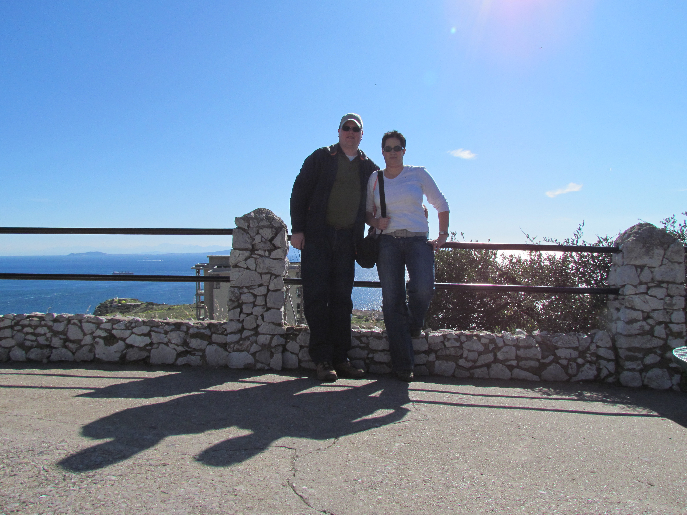
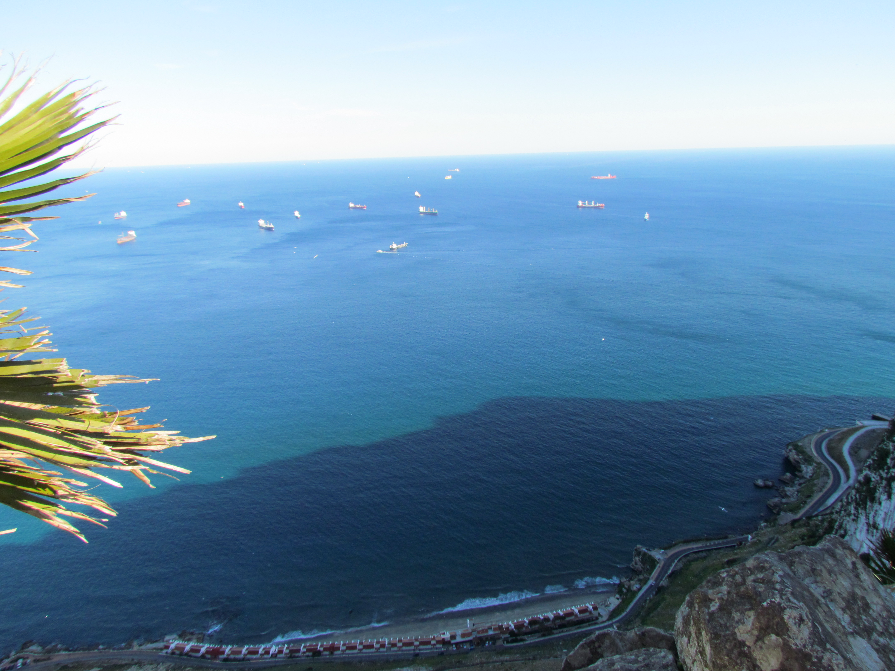
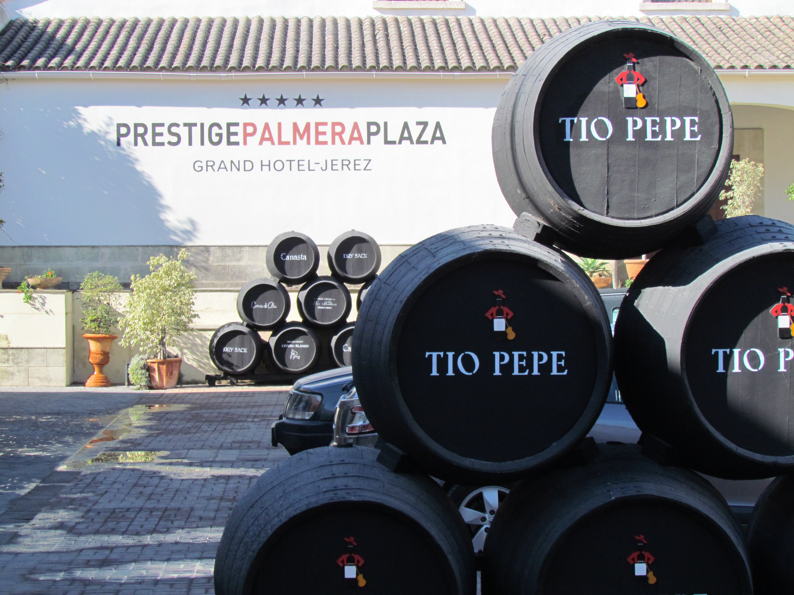

Omdat we wat laat aankwamen in Gibraltar, hebben we een taxi genomen die ons naar alle hoogtepunten heeft gereden.

De chauffeur vertelde van alles over The Rock. Blijft toch raar om zo ver in het zuiden aan de Mediterane mensen te horen spreken met zo'n overdreven Brits accent.

Aan de overkant kun je Marokko heel goed zien, het is maar 21 km!

We zijn inmiddels aangekomen in de sherry-stad Jerez de la Frontera. Gisteravond hebben we weer heerlijke tapas gegeten.

## 1 opmerking

### Sergio 15 februari 2012 om 17:45

Probeer de lokale drank Jerez...

veel plezier. y a su salud!!!
