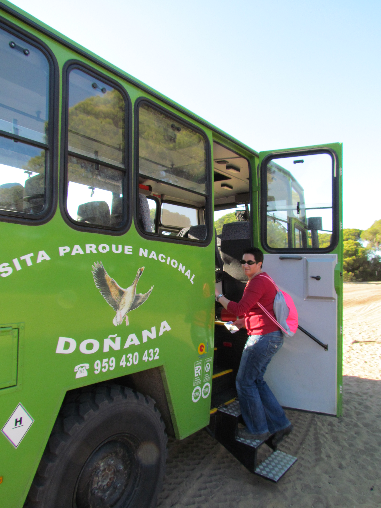
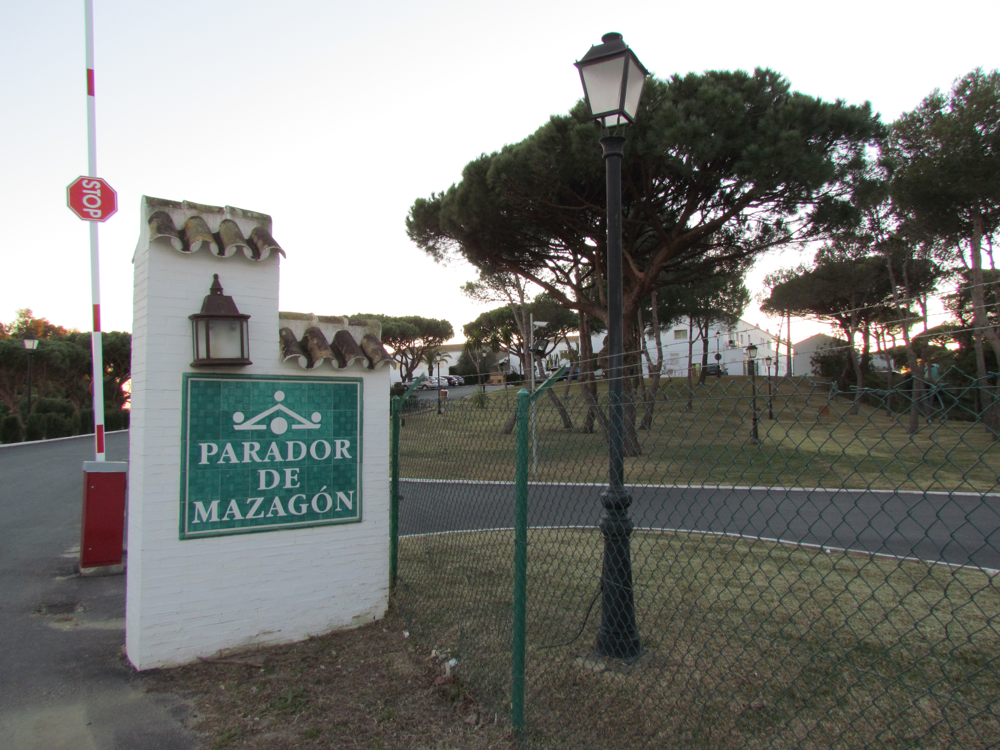
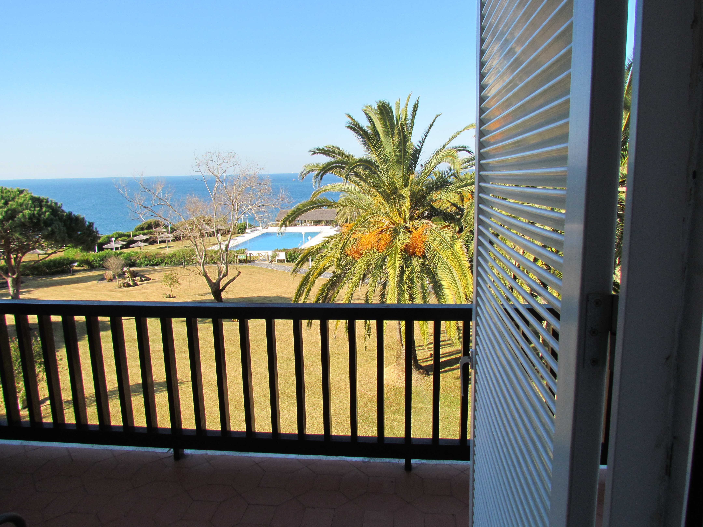
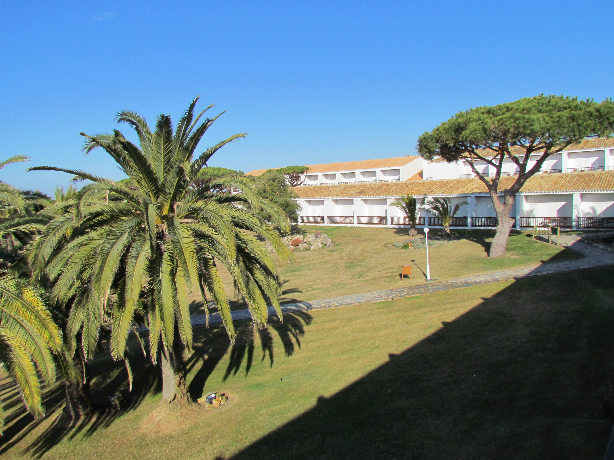

Een uurtje rijden van Sevilla ligt het nationaal park Doñana, een enorm uitgestrekt gebied waar je alleen met een gids in mag. Met enorme Mercedes bussen ga je vervolgens in 4 uur tijd door het park: van het strand met z'n mosselvangers, het bos met z'n vele herten en wilde varkens en de lagune met z'n vogels. Ondanks de lange zit was het zeer de moeite waard, en de gids sprak ook nog eens heel behoorlijk Engels.

De mosselvangers lopen in zee en schrapen dan de mossels van de bodem. Daarna wordt de vangst gezeefd, zodat alle zand, modder en schelpen eruit gehaald worden en de mossels overblijven.

We overnachten wederom in een mooie parador.

Vanuit onze hotelkamer kijken we uit over de zee.

