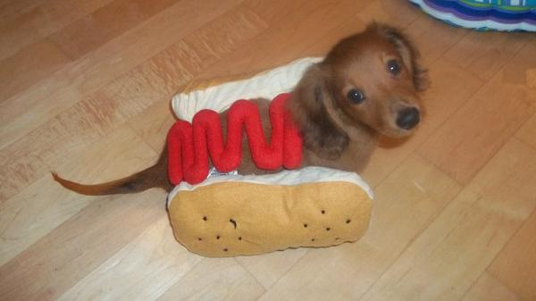

Hallo daar,

Het huis is schoon, de koffers zijn gepakt, de laatste batterijen worden opgeladen. Kortom: wij zijn er weer klaar voor!

Morgenmiddag vliegen we naar New York, en daar blijven we een paar dagen. Dinsdag gaan we de camper ophalen en dan rijden we naar het zuiden. Als eerste gaan we op de koffie bij Obama, en daarna zien we wel weer verder. Deze keer zijn vanwege drukte de plannen minder uitgewerkt dan anders, maar dat zal de pret niet drukken. Globaal hebben we wel een reisschema, maar voor nu ligt alleen de eerste week vast.

De oostkust van de VS wordt voor mij in ieder geval de eerste keer. Ik verheug me nu al op een lekkere hotdog in Central Park!

We zullen proberen onze avonturen hier zo vaak mogelijk bij te houden.

## 1 opmerking

### MacSprout24 mei 2012 om 12:09

Roger net gemist in Zeist, dus zo maar...

Veel plezier en zie jullie berichtjes/fotos hier wel verschijnen, hebben we weer wat afleiding wanneer wij weer aan het doorploeteren zijn. :-)

Leuke hotdog trouwens check wel ff voor vlooien voordat je je tanden er in zet...
