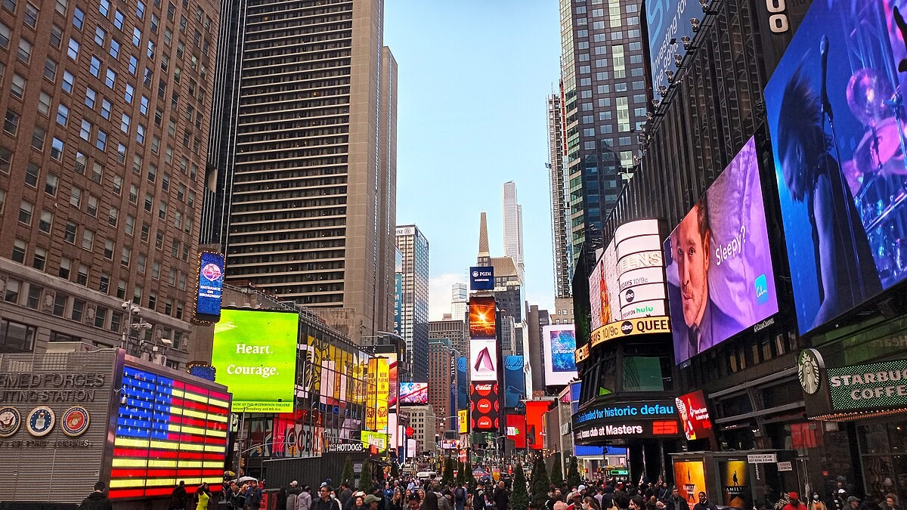

Overweldigend, dat is het eerste woord wat in me opkomt hier in New York. We zijn natuurlijk al eerder in wereldsteden geweest, maar hier is het toch allemaal groter, drukker, hectischer en ondanks dat we nog niet 1% gezien hebben, zijn we erg onder de indruk van het geheel.

Na een redelijk ontspannen vlucht van 7 uur kwamen we aan op JFK. Het ging erg vlot bij de douane (50 loketten!). Bij de bagagecaroussel stond Chantal naast Ronald de Boer. Toen even op zoek naar een pinautomaat en een taxi richting Manhattan. Na iets meer dan een uur waren we in ons hotel, pal tegenover de plek waar de WTC torens hebben gestaan.

Ze zijn druk bezig met nieuwe torens te bouwen, de Freedom Tower moet 1776 feet hoog worden, tevens het jaartal waarin de VS is opgericht (?), en wordt hiermee het hoogste gebouw van de VS.

We zijn direct met de metro naar Times Square gegaan om onze New York City Pass op te halen bij Planet Hollywood. Omdat we moe waren, hebben we daar maar meteen gegeten, en zijn we weer terug gegaan naar het hotel.

## 1 opmerking

### Sergio 30 mei 2012 om 13:00

1776 - onafhankelijkheidsverklaring...toen waren zij de terroristen ;-)
